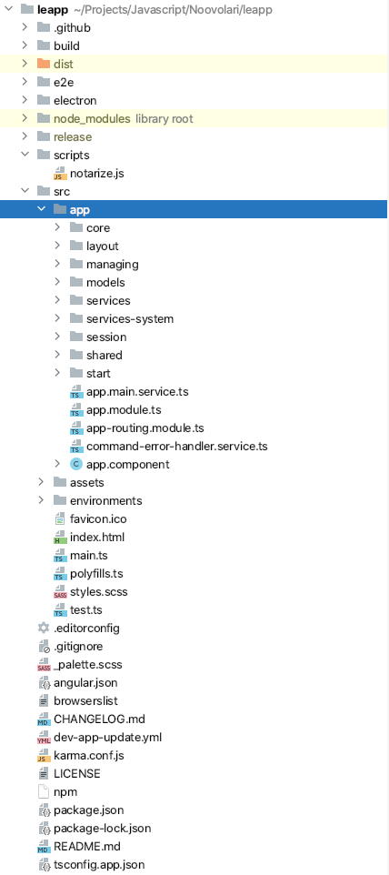

# Project Structure



Here we present all the different folders of the project as well as the files in order to explain what each directory and file does and how you can modify these files according to your necessities

## build and dist

**build** and **dist** are generated by the solution when a user requests a build with npm. For example: `npm run dist mac dev` . The content of these folders is auto-generated so you don't need to manage yourself.

## e2e

**e2e is another folder which is part of the project itself and doesn't need to be managed.**

## electron

Is the folder generated by Electron and contains the **main.ts** file which drives the application setup and start. This is created after the Angular project has been set up.

## node_modules

No need to add explanations here. Just your regular black hole of libraries.

## release

Release contains your built app for the OS you have asked for with the commands:

- `npm run dist mac dev / npm run dist mac prod`
- `npm run dist deb dev / npm run dist deb prod`
- `npm run dist win dev / npm run dist win prod`

The package is ready to be distributed but for the time being the release is done locally by developer previous QA and acceptance.


## scripts

Contains 2 scripts:

- **changeProductName.js:** that we use for managing the app versioning following the rules of semantic versioning
- **notarize.js:** is created to allow notarizing of Apple apps, in order to avoid requesting validation from the user before actually running the application

## src/app

Inside we put the actual application code written for Angular 8. The application itself is already divided into folders to help recognize the different content and maintain the solution organized.

— **core**

**Core** contains all the typescript files that are not directly related to Angular Components or Module and they typically are helpers functions or core logic methods. If you need to create something that does not belong to another folder, put it in here.

— **layout**

**Layout** contains all the layouts used by components to standardize some aspects of the applications. At this moment we don't have a particular layout and the application show pages directly from the `<app-root>` tag in the **index.html**

- **managing**

**managing** contains the create component which is used to create all type of accounts.

— **models**

In **models** we put all the interfaces that define models for our application. We use them to simplify description of types for complex objects in typescript as well as defining specific templates to interpret data managed by the services. An example:

- Configuration

```tsx
export interface Configuration {
  uid: string;
  language: string;
  defaultWorkspace: string;
  avatar: string;
  federationUrl: string;
  workspaces: Workspace[];
}
```

— **services**

**Services** are used to define the logic behind the client and are called by the actual components when they need it. All services extends the **NativeService** one as it allows to access Electron specific libraries and methods inside Angular application. A simple one:

- ExecuteService

```tsx
import { Injectable } from '@angular/core';
import { NativeService } from './native-service';
import { Observable } from 'rxjs';

@Injectable({ providedIn: 'root' })
export class ExecuteServiceService extends NativeService {
  /**
   * Execute a command: if the command contains sudo the system launch it with sudo prompt.
   * Note: with the current version of Electron the sandbox option for Chromium don't allow for sudo prompt on Ubuntu machines 16+
   * Remove the note whenever a fix is found.
   * @param command - the command to launch
   * @returns an {Observable<any>} to use for subscribing to success or error event on the command termination:
   *          the default Unix standard is used so 0 represent a success code, everything else is an error code
   */
  public execute(command: string, force?: boolean): Observable<any> {
    return new Observable(
      subscriber => {
        if (force) {
          subscriber.next('');
          subscriber.complete();
        }

        let exec = this.exec;
        if (command.startsWith('sudo')) {
          exec = this.sudo.exec;
          command = command.substring(5, command.length);
        }

        exec(command, {name: 'Leapp'}, (err, stdout, stderr) => {
          this.log.info('execute from Leapp: ', {error: err, standardout: stdout, standarderror: stderr});
          if (err) {
            subscriber.error(err);
          } else {
            subscriber.next(stdout ? stdout : stderr);
          }
          subscriber.complete();
        });
      }
    );
  }

  /**
   * Open a command terminal and launch a generic command
   * @param command - the command to launch in terminal
   * @returns an {Observable<any>} to subscribe to
   */
  public openTerminal(command: string): Observable<any> {
    return this.execute(`osascript -e "tell app \\"Terminal\\"
                              do script \\"${command}\\"
                              end tell"`);
  }
}
```

— **session**

Contains all the **components** needed to manage all session related actions and screens. This is the list with a little explanation for everyone.

- **session:** the page we have access to the quick list and can start and stop a specific session, thus creating or removing credentials.
- **session-card:** is simply a component that manage the single card.

— **shared** 

Shared is the area where all the shared component/helpers are located and ready to be used in other components. Remember to add them to the shared module in order to make them visible in the application.

— **start**

**start** contains all the components used for the first setup and the entry point of the application. The list of component here:

- **start-screen**: a page to welcome the user and verify if the initial setup is needed.

the other files inside the directory are defined by the application itself, there are simple configurations to make them work but basically can be left untouched.

— **assets**

assets contain all the graphics of the application.

— **environments**

Contains 3 files: each one represents a configuration for one of the 3 possible builds: dev, stag, and prod.

## index.html

This can be used to inject some Electron specific libraries in the actual Angular application. Follow this example:

- Locate this area in the page:

```html
<script>
  window.log = require('electron-log');
  window.fs = require('fs');
  window.rimraf = require('rimraf');
  window.os = require('os');
  window.ini = require('ini');
```

- add your new library in the format:

```html
window.<unique_name> = require('your-library');
```

- Now go to the **native-service.ts** and add your new library mimicking the other ones in the page:

```html
protected <unique_name>: any;
...
this.<unique_name> = (window as any).<unique_name>;
