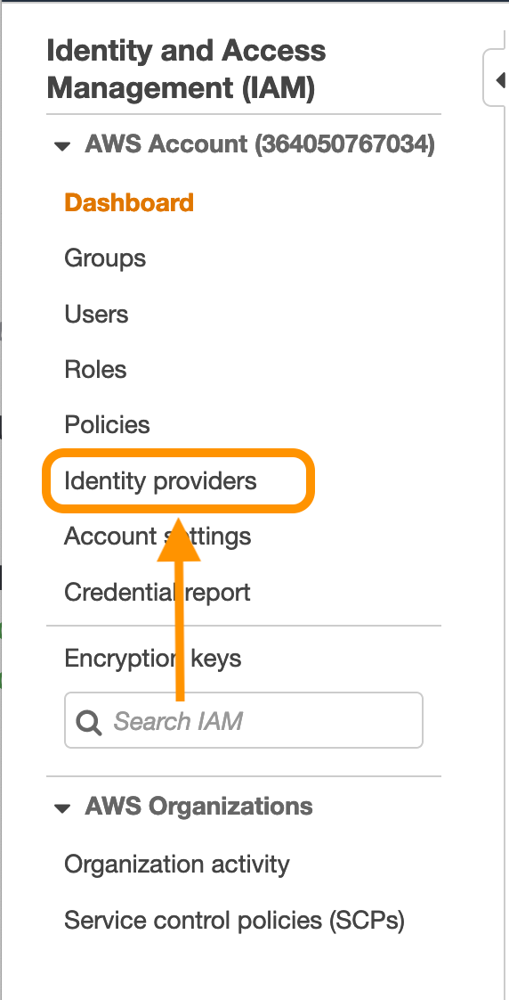
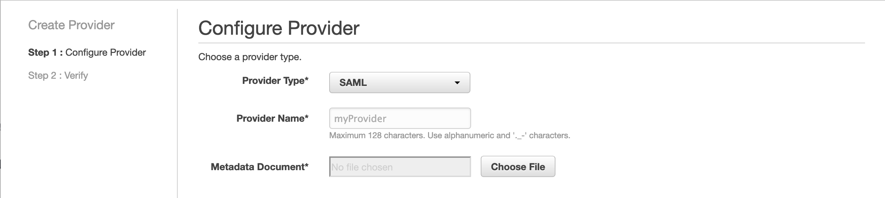

# How to federate your AWS account with G Suite

To enable the federation from both sides you have to create an Identity Provider entity in your AWS account.

## 1. Log into your AWS Account
Open the IAM section, and from the left-side column select Identity Providers.

## 2. Create a Provider 
Click on **Create Provider**, select **SAML** in the **Provider Type** dropdown and choose a name for the Provider (eg. "GSuiteSAML") and upload the metadata.xml file previously downloaded [link tutorial 1].

## 3. Save
Your AWS account is successfully federated with G Suite. Now you can start to create, modify, and assign roles to Principals.

Follow up to the next tutorial to learn how to create or edit a role to be automatically assumed after Single-Sign-On.

