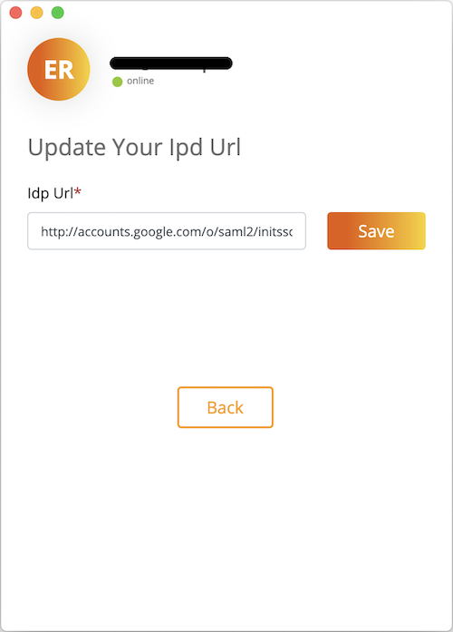

# Configure your SAML Application SSO URL
The SAML Application URL used by Leapp to authenticate against your Identity Provider. The authentication process returns a SAML Assertion that will be provided to the Service Provider to generate temporary credentials to access your Cloud Resources.

You can configure or modify your IdP URL from Leapp's profile section.

