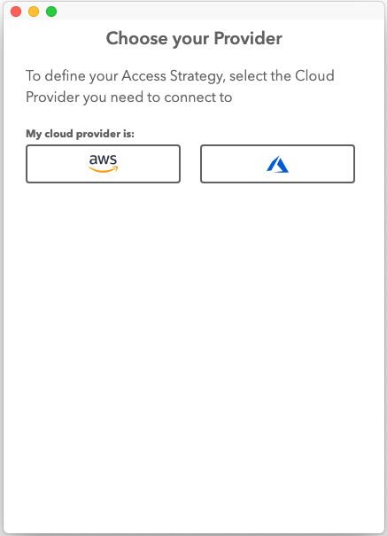
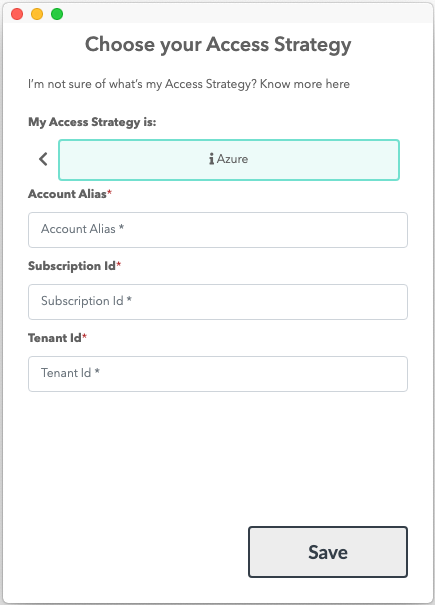

# If this is your first time accessing Leapp please follow this guide[link a first access guide].

If this is your first time accessing Leapp please follow this guide[link a first access guide].

1) From your quick list click on the "+" button located on the top-right corner of the app

You'll be presented with the **Provider Selection** screen:

2) Choose "**Azure**" as a Cloud Provider.

3) As the last screen you'll be presented with the actual account creation screen:

- **Account Alias:** choose a unique name suitable to recognize the Access Strategy.
- **Subscription Id:** get the subscription Id from Azure Active Directory in the Azure console
- **Tenant Id**: get the tenant Id from Azure Directory in the Azure console

 

Finally press **Save**.
