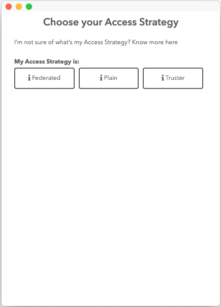
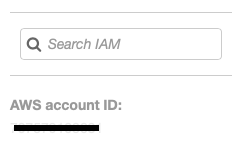
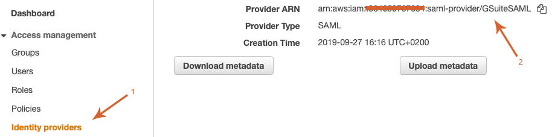

# How to create a Federated Account for AWS with Leapp

If this is your first time accessing Leapp please follow this guide: [First setup](FIRST_SETUP.md).

1) From your quick list click on the "+" button located on the top-right corner of the app

You'll be presented with the **Provider Selection** screen:

2) Choose "**AWS**" as a Cloud Provider, than you'll be presented with the **Access Strategy** selection screen:

Select "**Federated**" as the Access Strategy.

3) As the last screen you'll be presented with the actual account creation screen:

- **Account Alias:** choose a unique name suitable to recognize the Access Strategy.
- **Account Number**: Grab the account number from your aws account (Go to IAM service and check for the bottom-left screen).

    

- **Role**: Write the name of the role you want to assume inside your Federated Account.
- **IdpARN**: Is the Idp ARN you can recover by going into your AWS Account → IAM service → Identity Providers → Select your GSUITE federation → copy the ARN value as shown in the screenshot:

    

Finally press **Save**.
