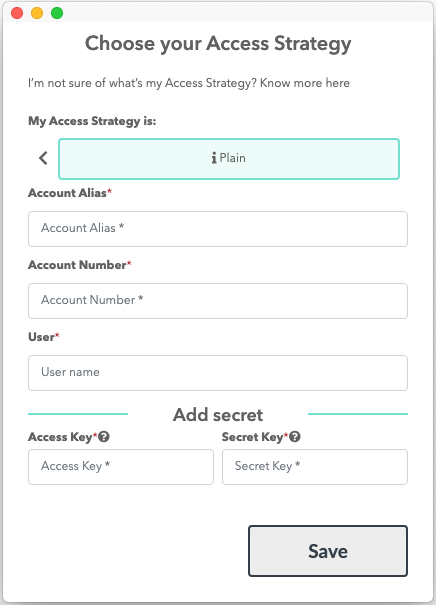
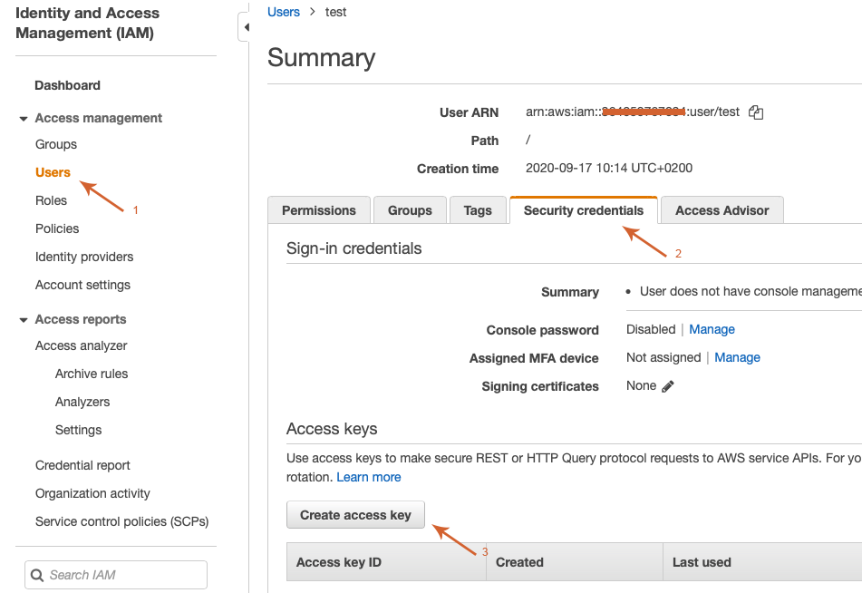

# How to create a Plain Account for AWS with Leapp

If this is your first time accessing Leapp please follow this guide[link a first access guide].

1) From your quick list click on the "+" button located on the top-right corner of the app

You'll be presented with the **Provider Selection** screen:

2) Choose "**AWS**" as a Cloud Provider, than you'll be presented with the **Access Strategy** selection screen:

Select "**Plain**" as the Access Strategy.

3) As the last screen you'll be presented with the actual account creation screen:

- **Account Alias:** choose a unique name suitable to recognize the Access Strategy.
- **Account Number**: Grab the account number from your aws account (Go to IAM service and check for the bottom-left screen).

    
- **User**: Write the name of the user you want to use inside your Plain Account.
- **Access Key / Secret Key:** get the credentials from your IAM User as shown below:

    

     

Finally press **Save**.
