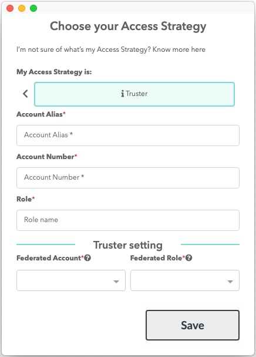

# How to create a Truster Account from a Federated Account for AWS with Leapp

If this is your first time accessing Leapp please follow this guide[link a first access guide].

1) From your quick list click on the "+" button located on the top-right corner of the app

You'll be presented with the **Provider Selection** screen:

2) Choose "**AWS**" as a Cloud Provider, than you'll be presented with the **Access Strategy** selection screen:

Select "**Truster**" as the Access Strategy.

3) As the last screen you'll be presented with the actual account creation screen:

- **Account Alias:** choose a unique name suitable to recognize the Access Strategy.
- **Account Number**: Grab the account number from your aws account (Go to IAM service and check for the bottom-left screen).

    

- **Role**: Write the name of the role you want to assume inside your Federated Account.
- **Federated Account**: select one of your previous created Federated Account. This will enable a Federated Role to be chosen for the Federated Role as well.

    **Federated Role**: verify that the federated role set by Leapp is the one you expect to be used for **assume role**.

     

Finally press **Save**.
