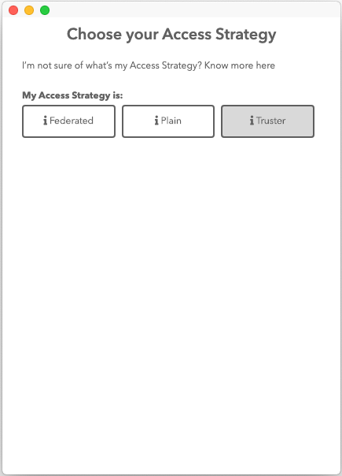
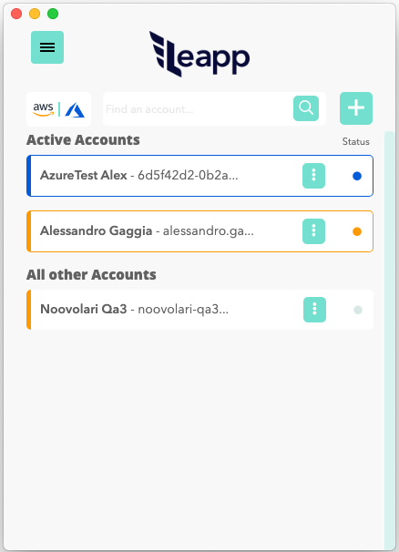

# First Launch Setup

When you first launch Leapp you'll be asked to setup an Account for generating credentials. You'll be presented with the following scheme:

If you select "**AWS**" you'll be presented with a Strategy selection screen, only truster is disabled, instead you'll have the choice to select "**Federated**" or "**Plain**":

Either you choose one of them, please follow these other tutorials:

[How to create a Federated Account for AWS with Leapp](CREATE_FEDERATED_ACCOUNT.md)

[How to create a Plain Account for AWS with Leapp](CREATE_PLAIN_ACCOUNT.md)

---

If you select "Azure" you'll have to follow the following tutorial:

[How to create an Azure Account from Azure AD with Leapp](CREATE_AZURE_ACCOUNT.md)

---

After completing the setup you'll be presented with the list of sessions available to you to connect to:

