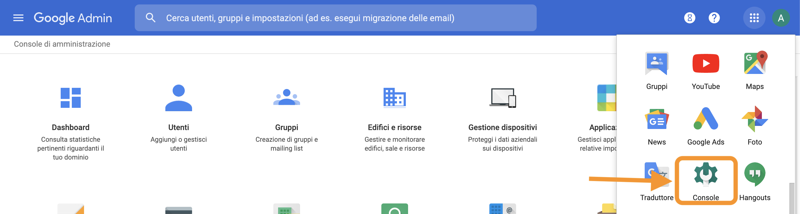
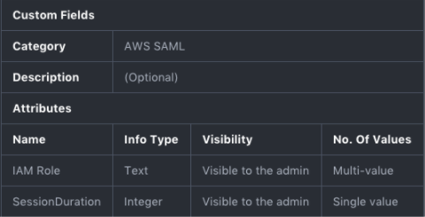
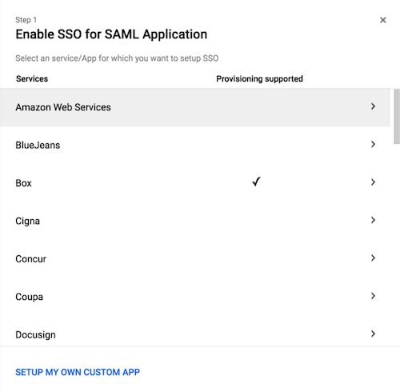
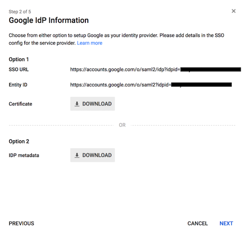
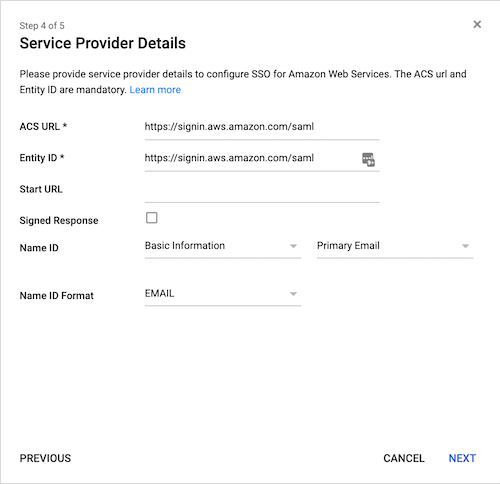
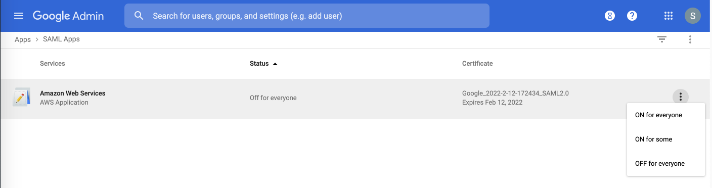

# How to set up G Suite federation

Let’s start with G Suite & AWS federation:

## 1. Log in to your Google Admin Console

## 2. Create a new category of custom attributes

### a. Click *Manage Custom Attributes*

In the G Suite directory browse to *Users* and select *More* from the top menu. Then select “**Manage Custom Attributes”.**

### b. Choose “Add Custom Attribute”

In the top-right corner of the page click on “Add Custom Attribute”.

### c. Fill the Form

Fill the form with values provided into table 1

## 3. Create a SAML-Based application

In order to set up a SAML-Based Single Sign-On, we first need to create a custom application representing AWS.

### a. Browse to the "Apps" section

### b. Add a new SAML application

### [Step 1 of 5] Select Amazon Web Services template**

Click on the “plus” icon in the bottom-right corner and then select the preconfigured template for AWS.

### [Step 2 of 5] Save the IDP Metadata file
The IDP Metadata is a .xml file containing configuration parameters and the X509 certificate. It enables the trust relationship between Identity and Service Provider. Save it; we will use it in a later step.
> :warning: **The metadata file must be kept secret and securely stored **: the security of the solution relies on its secrecy.

### [Step 3 of 5] Skip it
Nothing useful here, let's proceed.

### [Step 4 of 5] Choose the Service Provider’s details id
Under **Service Provider Details**, select **EMAIL** choosing from the **Name ID Format** drop-down.

### [Step 5 of 5] Add the attribute Mapping
The attributes previously created at **[Step 2 of 5]** are associated and mapped to the **SAML assertion**. Add a new mapping:

- [https://aws.amazon.com/SAML/Attributes/RoleSessionName](https://aws.amazon.com/SAML/Attributes/RoleSessionName) -> Basic Information -> Primary Email
- [https://aws.amazon.com/SAML/Attributes/Role](https://aws.amazon.com/SAML/Attributes/Role) -> AWS_SAML -> IAM_Role
- [https://aws.amazon.com/SAML/Attributes/SessionDuration](https://aws.amazon.com/SAML/Attributes/SessionDuration) -> AWS_SAML -> SessionDuration

## 4. Enable the SAML App

### a. Turn ON the App

Go back to the **SAML app menu (from the Admin Panel, select “Apps”)** and select by clicking the menu icon, on the Amazon Web Services line.:
- **"ON for everyone"**
or
- **"ON for some"**

Now you’ve added the Amazon Web Service application to your App Google menu.

### b. Get the SAML App link
Click on your App Google menu, locate the new entry, and right-click on it to copy its value. We will need this in the next tutorial.

Congratulations, the first phase of the federation is complete, follow up with the next tutorial to set up the federation on AWS side.
