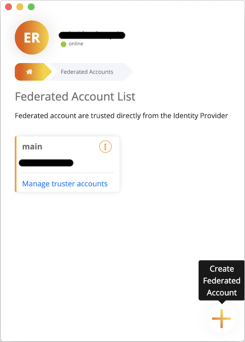
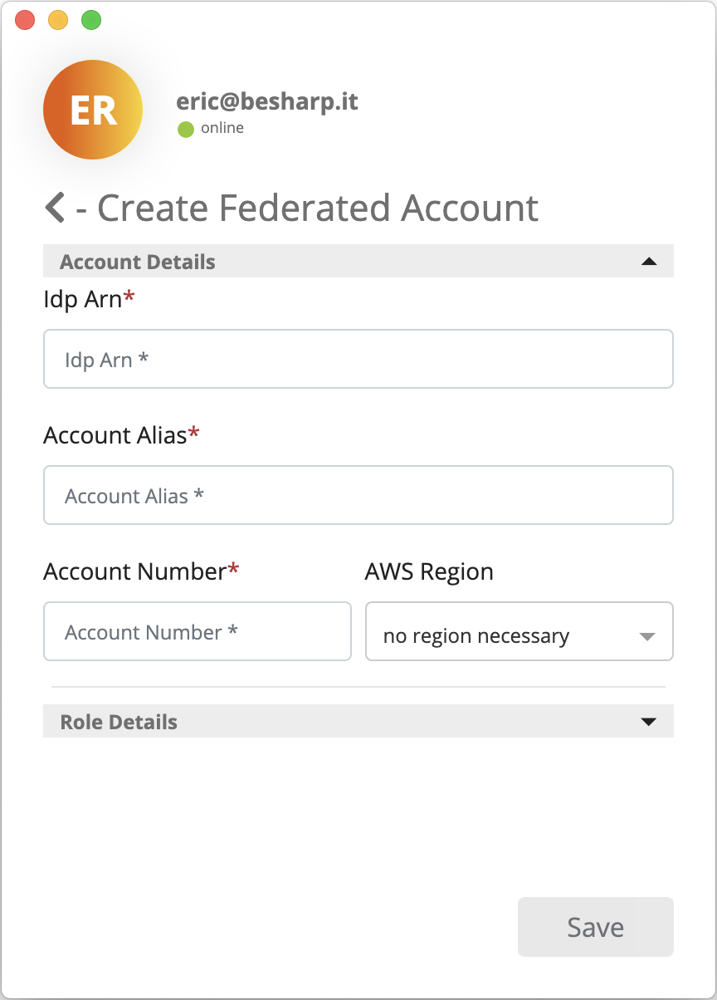
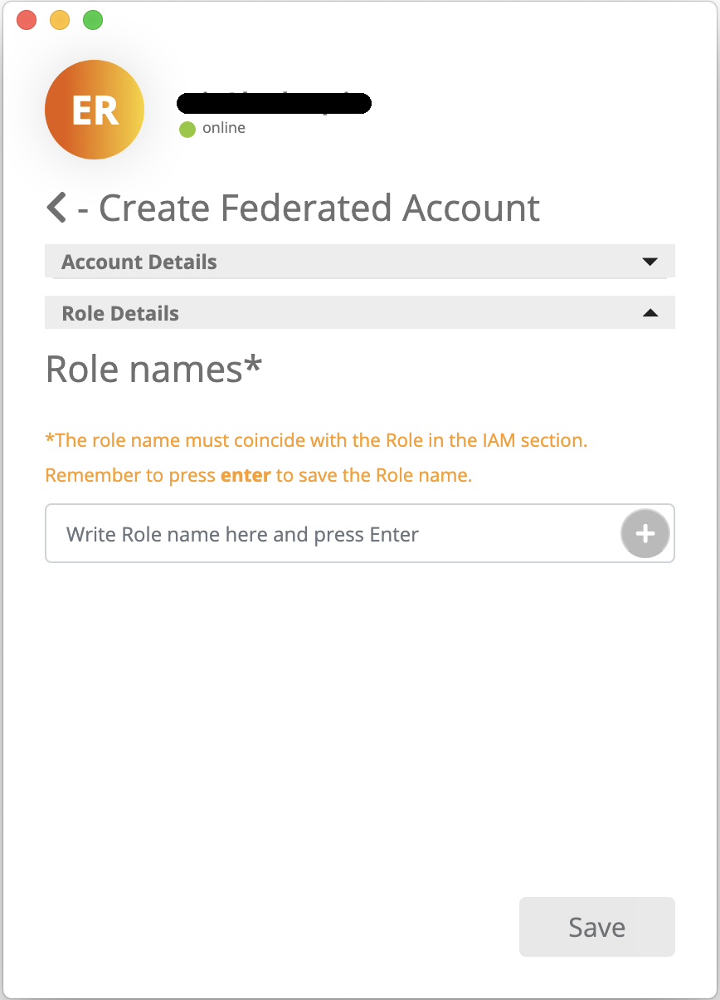
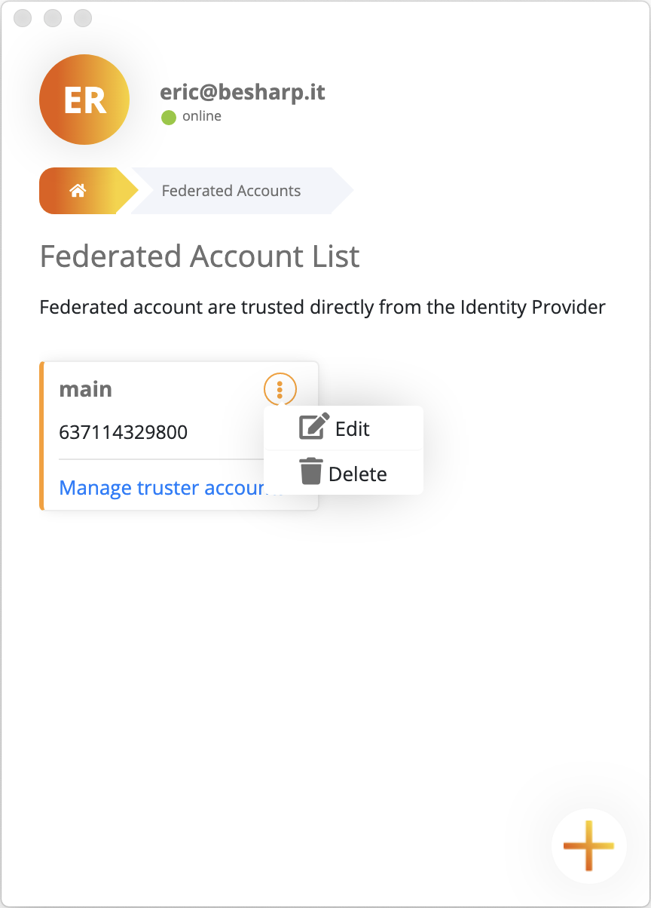

# Manage Federated Accounts and Federated Roles

You can access the Account Management section from the Quick List, as you can see in the following picture.

When you enter the Access Management section, the first thing you'll see is a list of Federated Accounts. If you want to add a new Federated Account you've to click on the cross button in the bottom-right of the window.

To creare the Federated Account you've to specify Account and Role Details.

- **Account Details**

    

    - **IdP ARN:** the Amazon Resource Name of the IAM Identity Provider object that resides in your Federated Account.
    - **Account Alias:** an alias that you want to attribute to the Federated Account.
    - **Account Number:** the Federated Account 12-digit identifier.
    - **AWS Region:** if you set this parameter, Service Provider's API responses will be filtered by the specified region.
- **Role Details**

    

    - **Role Names:** names of the Federated Roles that can be assumed through **assume-role-with-saml** API. In case of Truster Account, those names refer to the Truster Roles that can be assumed through **assume-role** API by a Federated Role.

Once created, a Federated Account may be edited or deleted.

