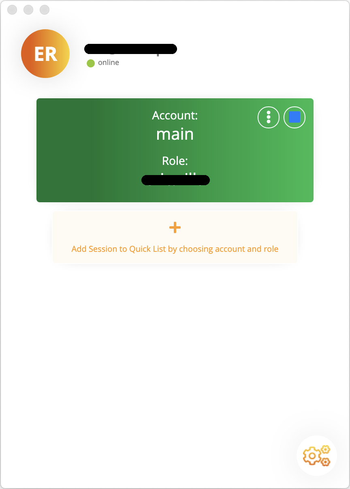

# Manage Quick List

The Quick List represents a fast way to generate temporary credentials associated to a Session, which is defined by the couple Account/Role. Account and Roles could be either Federated or Truster.

If you want to add a new Session to the Quick List, you have to specify the Account you want to access and the Role you want to assume. Moreover, you can choose the Session card's color.

