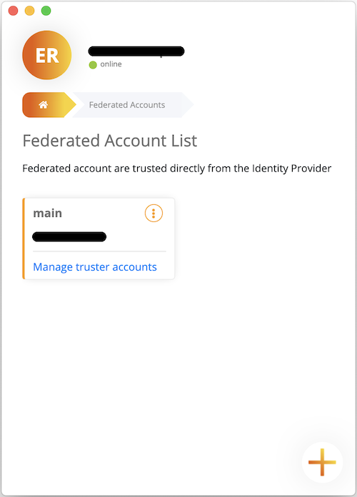
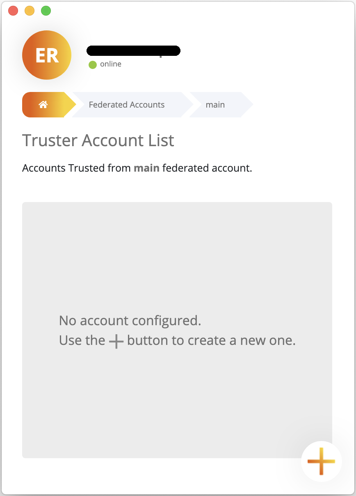
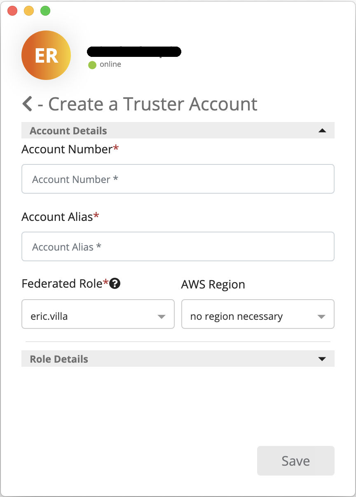

# Manage Truster Accounts and Truster Roles

As for Federated Accounts, you've to move to the Account Management section. Truster Accounts can be created from a Federated Account. On a Federated Account's card you can find the "Manage truster accounts" link, that you've to click to access the Truster Account List associated to the specific Federated Account.

As for Federated Accounts, during Truster Account creation, you have to specify both Account Details and Role Details.

- **Account Details**

    

    As you can see from the picture above, there is no need to specify the IdP ARN, since Truster Accounts should not contain a IAM Identity Provider, i.e. the definition of the Identity Provider in the context of the AWS Account. In addition to Account Number and Account Alias, previously described in the Manage Federated Accounts and Federated Roles, you have to specify the Federated Role that should be used to assume Truster Roles inside the Truster Account.

- **Role Details**
    - **Role Names:** names of the Truster Roles that can be assumed through **assume-role** API using Federated Role's credentials.
