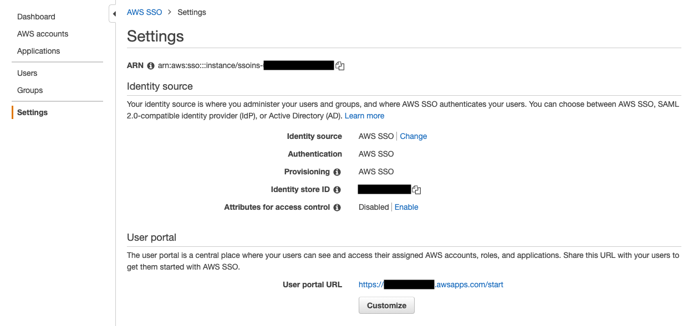
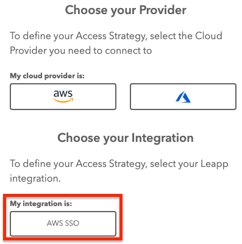
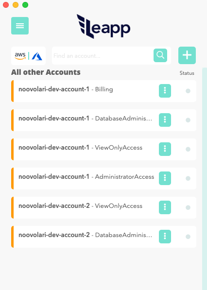

Leapp
=========
[](https://github.com/Noovolari/leapp/releases/latest)
- Website: https://www.leapp.cloud/
- Roadmap: [Roadmap](https://github.com/Noovolari/leapp/projects/1)
- Use Cases: [Use Cases](#use-cases)
- Chat with us: [Discord](https://discord.gg/wHh2kyK)


Leapp is a DevTool Desktop App designed to **manage and secure Cloud Access in multi-account environments.**

The App is designed to work with Cloud Providers APIs, CLIs, and SDKs.

It's a tool that securely [**stores your access information in a secure place**](.github/vault_strategy/strategy.md) and generates temporary credential sets to access your Cloud from your local machine.

> We Strongly believe that access information to Cloud in `~/.aws` or `~/.azure` files are not safe, and we prefer to store that information in an encrypted file managed by the system. 
> Credentials will be hourly rotated and accessible in those files only when they are needed, so only when Leapp is active.


# Table of Contents

- [Key features](#key-features)
- [Installation](#installation)
- [Use Cases](#use-cases)
  * [AWS Plain Access](#aws-plain-access)
  * [AWS Federated Access](#aws-federated-access)
  * [AWS SSO](#aws-sso)
  * [AWS Truster Access](#aws-truster-access)
  * [Azure Access](#azure-access)
- [Supported Providers](#supported-providers)
  * [Cloud Providers](#cloud-providers)
  * [Identity Providers](#identity-providers)
- [Rotating Credentials](#rotating-credentials)
- [Multi-Factor Authentication](#multi-factor-authentication)
  * [Setup MFA in AWS](#setup-mfa-in-aws)
    + [MFA restricted access](#mfa-restricted-access)
  * [Setup MFA in Leapp](#setup-mfa-in-leapp)
  * [Temporary credentials durations](#temporary-credentials-durations)
    + [Plain and Truster session token management](#plain-and-truster-session-token-management)
- [AWS SSO](#aws-sso)
- [Integrations](#integrations)    
- [HTTP/HTTPS in-app proxy](#httphttps-in-app-proxy)
    + [Note for Azure Sessions](#note-for-azure-sessions)
- [Logs](#logs)
- [Quick List](#quick-list)
  * [Links](#links)
  * [License](#license)


# Key features
### Switch account in a click
No need to manage the credentials file. Get connected to your accounts in a click. 
### Secure repository for your access data
Protect your cloud accounts access data in the system vault and connect straight away.
### Multiple cloud access strategies
Connect with federated single sign-on, roles or static credentials. Check [here](#supported-providers) what's currently supported.
### No static credentials
Generate and inject only temporary credentials to comply with security best-practices.
### Generate and use sessions directly from your AWS Organizations
Centrally manage access to multiple AWS accounts with single sign-on access from one place
### Direct infrastructure connection
Connect to your virtual machines with AWS System Manager.


# Installation
Get [here](https://github.com/Noovolari/leapp/releases/latest) the latest release.

# Use Cases
Our use cases are hereby presented to give you a hint on how Leapp can be of help to depend on the type of setup 
you have in your company and what kind of credentials you need to get.

## AWS Plain Access
Store AWS IAM User's Access Keys in your System Vault through Leapp. 
Leapp automatically manages **Access Key ID** and **Secret Access Key** in your AWS credentials, 
generating temporary credentials for them.

**No credentials** are stored in Leapp. 

Please see [Vault strategy](.github/vault_strategy/strategy.md) for more information.


See setup [tutorial](.github/tutorials/TUTORIALS.md)

*Note: it's possible to assign an MFA device to a plain session. Please see [MFA section](#multi-factor-authentication) for more details.*

## AWS Federated Access
Leverage company identity to access environment through federated single sign-on. 
Federation is established between **G Suite** and **AWS**. No more AWS credentials 
management is needed. Leapp allows you to get to cloud resources with company email and password.


See setup [tutorial](.github/tutorials/TUTORIALS.md)

## AWS SSO
Leapp with AWS SSO offers a unique advantage: the ability to make AWS SSO compatible with virtually any 
tools or library that uses AWS credentials. If you are refraining from using AWS ORGANIZATION and AWS SSO 
because of incompatibilities with any of your daily tools or/and libraries, Leapp is the tool for you.

AWS SSO let create and manage user identities in AWS SSO’s identity store, easily 
connect to existing identity source, including Microsoft Active Directory, Okta Universal Directory, 
and Azure AD. Finally, trough Leapp, Developers have access to all their sessions from one tool.


See setup [tutorial](#aws-sso)

## AWS Truster Access
Federating each account is difficult so use truster accounts to grant access easier and painlessly.
We use federated role as a gateway to all trusted roles in all other AWS accounts.
In this access strategy a **truster role** is assumed by a **federated role**.


See setup [tutorial](.github/tutorials/TUTORIALS.md)

*Note: it's possible to apply MFA to a truster session by setting it on the plain account it relies on. Please see [MFA section](#multi-factor-authentication) for more details.*

## Azure Access
Use Leapp to do Single Sign On with G Suite on Azure to get access to your 
**Subscriptions**. In this use case is **mandatory** to have defined a Federation 
between Google and Azure. Leapp manage the login process for you to have Azure CLI 
ready to be used.


See setup [tutorial](.github/tutorials/TUTORIALS.md)

# Supported Providers
## Cloud Providers
- **AWS** - :white_check_mark:
- **AZURE** - :white_check_mark:
- **GCP** - :soon:
## Identity Providers
- **G Suite to AWS** - :white_check_mark:
- **G Suite to Azure** - :white_check_mark:
- **AZURE AD to Azure** - :white_check_mark:
- **AZURE AD to AWS** - :soon:
- **AWS SSO** - :white_check_mark:

# Rotating Credentials
Leapp is created with security in mind: that is, **NO** credentials are saved in our system whatsoever. 
Nor in code neither in our configuration file. Everytime a credential is generated 
is **temporary**, and **no long-term ones are ever saved** in plain accessible files or locations.

# Multi-Factor Authentication
Leapp support Multi-Factor Authentication for **AWS Plain and Truster** access strategies. 
The system will ask for the **MFA device ARN** provided by AWS when creating/editing 
a Plain session, which corresponds to an **AWS IAM User**.

## Setup MFA in AWS
To enable MFA for a specific IAM User, you need to assign an MFA device to it. Move to 
the Security Credentials tab within the IAM User's Summary. 


Once there, you should be able to find the *Assigned MFA device* configuration, from which a new MFA device can
be assigned to the user.
MFA protects access to your AWS Account prompting for a token when you try to start the
Leapp session.

### MFA restricted access
**MFA device ARN** is *necessary*, not *sufficient*, condition to protect access to your cloud resources. 
User or Apps can do operations on cloud resources without being prompted for an MFA code. To enforce MFA 
for specific actions described in a Role's policy, a `"Condition": {"Bool": {"aws:MultiFactorAuthPresent": "true"}}` 
statement must be present for action `"Action": "sts:AssumeRole"` in the role policy.

## Setup MFA in Leapp
To assign an MFA device to a **plain account** just insert a *physical device's serial number*, or an *MFA device ARN* in 
the corresponding field of plain strategy's form. The device is then associated with that specific session, and the **MFA token** will be prompted
when the session starts.

*Note 1: if you need to remove MFA from a plain session, just edit it and leave the field blank.*
*Note 2: when you set up a truster account from a plain session with MFA enabled, **Leapp** inherently associates MFA checks to it.*

## Temporary credentials durations
There are 2 **environment variables** contained in Leapp which define how a session is managed:
* *session duration*: defines **how often** the system will refresh your **temporary** credentials. [defaults to 1200s / 20min]
* *session token duration* defines **how long** the **session token** will be used for each *session duration* refresh action. [defaults to 36000s / 10h] 

### Plain and Truster session token management
**Plain session**: newly generated session tokens are valid for 10 hours, which corresponds to the value specified in the *session token duration* environment variable.
Leapp stores session tokens inside your OS's specific vault, from which they are retrieved as long as they're valid.
Every 20 minutes - i.e. the value specified in the *session duration* environment variable - Leapp refreshes the credential file with a valid session token, or a newly generated one.
If you have enabled MFA for a Plain session, Leapp will prompt for an MFA token only if the session token is no more valid.

**Truster session from Plain**: when you create a Truster session, you've to define the Federated Role or Plain IAM User that will *assume* the Truster Role specified in the Truster session.

If the Truster Role is assumed by a Plain IAM User, the following two steps will be covered.
- A session token, related to the Plain IAM User, will be generated; this session token will be managed by Leapp in the same way described in **Plain session**.
- The session token is used to assume the Truster Role, generating new temporary credentials that will be written in the credentials file and refreshed every 20 minutes.

If the Truster Role is assumed by a Federated Role, the following two steps will be covered.
- A set of temporary credentials - associated to the Federated Role - will be generated through SAML federated Single Sign-On; 
in particular, the Security Token Service's AssumeRoleWithSAML API is called, passing in the SAML assertion returned by the Identity Provider.
- The temporary credentials - associated to the Federated Role - are used to assume the Truster Role, obtaining new temporary credentials associated to the Truster Role.
This set of temporary credentials is used to refresh the credentials file.

# Integrations
The idea behind Integrations is to integrate external services into the Leapp's flow, in order to embrace your specific Use Case.
For example, you could integrate Leapp's flow with an external Identity Provider where you store and manage your Users, or Keychain where you want your credentials to be stored in.
Following this concept, we added support to AWS SSO; through this integration, Leapp is able to retrieve Session information and obtain temporary credentials associated to them.

## AWS SSO
With AWS SSO, you can easily manage access and user permissions to all of your accounts in 
AWS Organizations centrally, with no additional setup within the individual accounts. You can 
assign user permissions based on common job functions, customize them to meet your specific 
security requirements, and assign the permissions to users or groups in the specific accounts where 
they need access. For example, you can give your security team administrative-level access to your 
AWS accounts running your security tools, but only grant them auditor-level access to your other AWS 
accounts for monitoring purposes.

### Why Using AWS SSO with Leapp
When using AWS SSO directly with tools like AWS CLI V2 a specific profile is defined for the 
user when using *aws configure*. Because of that you lose compatibility with lots of tools 
and libraries that uses the standard profile. Leapp believes that tools and software must 
always use simple, flat, short-lived credentials, avoiding to leave any sensitive information 
in the profile. That is why Leapp **takes care for you** of the authentication process, no matter 
what strategy do you plan to use.

Because of this, Leapp allows AWS SSO to be compatible with AWS Cli V2 and many others libraries out 
there, because at the end of its process you'll have plain temporary credentials to use.

Do you have any issues from one or more of these libraries?

- [Rusoto](https://github.com/rusoto/rusoto/issues/1810)
- [Terraform Provider Aws](https://github.com/hashicorp/terraform-provider-aws/issues/10851)
- [Certonid](https://github.com/certonid/certonid/discussions/8)
- [Tailscale](https://github.com/tailscale/tailscale/issues/920)
- [Amazon-ecr-credential-helper](https://github.com/awslabs/amazon-ecr-credential-helper/issues/229)
- [Aws-sdk-go-v2](https://github.com/aws/aws-sdk-go-v2/issues/705)
- [Kubernetes Kops](https://github.com/kubernetes/kops/issues/8481)
- [Awsprocesscreds](https://github.com/awslabs/awsprocesscreds/issues/26)

Then Leapp is the solution for you!

### How Leapp integrates with AWS SSO under the hood

The Auth flow in AWS SSO is made up with OIDC and is divided in three different steps:

1. [RegisterClient](https://docs.aws.amazon.com/singlesignon/latest/OIDCAPIReference/API_RegisterClient.html)
2. [StartDeviceAuthorization](https://docs.aws.amazon.com/singlesignon/latest/OIDCAPIReference/API_StartDeviceAuthorization.html)
3. [CreateToken](https://docs.aws.amazon.com/singlesignon/latest/OIDCAPIReference/API_CreateToken.html)

*note: CREDENTIALS ARE NOT NEEDED FOR THOSE THREE CALLS*

The first thing we have to do is to register a local client.

> The AWS SSO OIDC service currently implements only the portions of the OAuth 2.0 Device Authorization Grant standard ([https://tools.ietf.org/html/rfc8628](https://tools.ietf.org/html/rfc8628)) that are necessary to enable SSO authentication with the AWS CLI. Support for other OIDC flows frequently needed for native applications, such as Authorization Code Flow (+ PKCE), is planned in future releases.

#### RegisterClient

As soon as the **aws sso** button is clicked, the RegisterClient Api will be invoked.

```json
aws sso-oidc register-client --client-name leapp --client-type public
```

*notes: public is the only client type available at the moment.*

it will generate a response like the one below:

```json
{
    "clientId": "ClhqC9rDzjY43Nh0nYEL-2V1LXdlc3QtMQ",
    "clientSecret": "eyJraWQiOiJrZXktMTU2Njk2ODAxMyIsImFsZyI6IkhTMzg0In0.eyJzZXJpYWxpemVkIjoie1wiZXhwaXJlZFwiOmZhbHNlLFwiY2xpZW50SWRcIjp7XCJ2YWx1ZVwiOlwiQ2xocUM5ckR6alk0M05oMG5ZRUwtMlYxTFhkbGMzUXRNUVwifSxcInRlbmFudElkXCI6bnVsbCxcImNsaWVudE5hbWVcIjpcImxlYXBwLXRlc3RcIixcImNsaWVudFR5cGVcIjpcIlBVQkxJQ1wiLFwidGVtcGxhdGVBcm5cIjpudWxsLFwidGVtcGxhdGVDb250ZXh0XCI6bnVsbCxcImV4cGlyYXRpb25UaW1lc3RhbXBcIjoxNjExNjc0Njg2Ljg0MTAwMDAwMCxcImNyZWF0ZWRUaW1lc3RhbXBcIjoxNjAzODk4Njg2Ljg0MTAwMDAwMCxcInVwZGF0ZWRUaW1lc3RhbXBcIjoxNjAzODk4Njg2Ljg0MTAwMDAwMCxcImNyZWF0ZWRCeVwiOm51bGwsXCJ1cGRhdGVkQnlcIjpudWxsLFwic3RhdHVzXCI6bnVsbCxcImluaXRpYXRlTG9naW5VcmlcIjpudWxsLFwiZW50aXRsZWRSZXNvdXJjZUlkXCI6bnVsbCxcImVudGl0bGVkUmVzb3VyY2VDb250YWluZXJJZFwiOm51bGwsXCJleHRlcm5hbElkXCI6bnVsbH0ifQ.s5fnQhh7J70RGxcUsSUvI08ptEr8dqIWPQRVAq0DFGrdsqea6d411ExkKhbGJRlK",
    "clientIdIssuedAt": 1603898686,
    "clientSecretExpiresAt": 1611674686
}
```

By decoding the Client secret you will see:

```json
{
  "expired": false,
  "clientId": {
    "value": "R-j5yN-4-TPNs...tMQ"
  },
  "clientName": "my-client",
  "clientType": "PUBLIC",
  "templateArn": null,
  "templateContext": null,
  "expirationTimestamp": 1594932567.612,
  "createdTimestamp": 1587156567.612,
  "updatedTimestamp": 1587156567.612,
  "createdBy": null,
  "updatedBy": null
}
```

We have to locally save those info and pass them into the next call.

#### StartDeviceAuthorization

In order to make this call the user of Leapp need to have registered into AWS SSO and provide a valid start-url, that is the **portal url**


Having a valid OIDC client registration we can now initiate the device authorization flow using the [StartDeviceAuthorization](https://docs.aws.amazon.com/singlesignon/latest/OIDCAPIReference/API_StartDeviceAuthorization.html) API action.

```jsx
aws sso-oidc start-device-authorization 
--client-id mVZBEoa-gUBj8nugHZUIsWV1LXdlc3QtMQ 
--client-secret eyJraWQiOiJrZXktMTU2Njk2ODAxMyIsImFsZyI6IkhTMzg0In0.eyJzZXJpYWxpemVkIjoie1wiZXhwaXJlZFwiOmZhbHNlLFwiY2xpZW50SWRcIjp7XCJ2YWx1ZVwiOlwibVZaQkVvYS1nVUJqOG51Z0haVUlzV1YxTFhkbGMzUXRNUVwifSxcInRlbmFudElkXCI6bnVsbCxcImNsaWVudE5hbWVcIjpcImxlYXBwXCIsXCJjbGllbnRUeXBlXCI6XCJQVUJMSUNcIixcInRlbXBsYXRlQXJuXCI6bnVsbCxcInRlbXBsYXRlQ29udGV4dFwiOm51bGwsXCJleHBpcmF0aW9uVGltZXN0YW1wXCI6MTYxMTU2ODM0MS45MDkwMDAwMDAsXCJjcmVhdGVkVGltZXN0YW1wXCI6MTYwMzc5MjM0MS45MDkwMDAwMDAsXCJ1cGRhdGVkVGltZXN0YW1wXCI6MTYwMzc5MjM0MS45MDkwMDAwMDAsXCJjcmVhdGVkQnlcIjpudWxsLFwidXBkYXRlZEJ5XCI6bnVsbCxcInN0YXR1c1wiOm51bGwsXCJpbml0aWF0ZUxvZ2luVXJpXCI6bnVsbCxcImVudGl0bGVkUmVzb3VyY2VJZFwiOm51bGwsXCJlbnRpdGxlZFJlc291cmNlQ29udGFpbmVySWRcIjpudWxsLFwiZXh0ZXJuYWxJZFwiOm51bGx9In0.nyRt2ELVoiBh95GiZ_Igzzsn4DkzwfiU446c0lvuS9yqJe5Fk2Ra_tV-htKetQH8 
--start-url [https://u](https://awscli.amazonaws.com/v2/documentation/api/latest/reference/sso-oidc/start-device-authorization.html)rltoSSOendpoint
```

That will produce a response like this: 

```json
{
  "deviceCode": "8Acq...DUg",
  "expiresIn": 600,
  "interval": 1,
  "userCode": "RPXP-JSQA",
  "verificationUri": "https://device.sso.eu-central-1.amazonaws.com/",
  "verificationUriComplete": "https://device.sso.eu-central-1.amazonaws.com/?user_code=RPXP-JSQA"
}
```

Where:

- **[deviceCode](https://docs.aws.amazon.com/singlesignon/latest/OIDCAPIReference/API_StartDeviceAuthorization.html#API_StartDeviceAuthorization_ResponseSyntax):** The short-lived code that is used by the device when polling for a session token.
- **[expiresIn](https://docs.aws.amazon.com/singlesignon/latest/OIDCAPIReference/API_StartDeviceAuthorization.html#API_StartDeviceAuthorization_ResponseSyntax):** Indicates the number of seconds in which the verification code will become invalid.
- **[interval](https://docs.aws.amazon.com/singlesignon/latest/OIDCAPIReference/API_StartDeviceAuthorization.html#API_StartDeviceAuthorization_ResponseSyntax):** Indicates the number of seconds the client must wait between attempts when polling for a session.
- **[userCode](https://docs.aws.amazon.com/singlesignon/latest/OIDCAPIReference/API_StartDeviceAuthorization.html#API_StartDeviceAuthorization_ResponseSyntax):** A one-time user verification code. This is needed to authorize an in-use device.
- **[verificationUri](https://docs.aws.amazon.com/singlesignon/latest/OIDCAPIReference/API_StartDeviceAuthorization.html#API_StartDeviceAuthorization_ResponseSyntax):** The URI of the verification page that takes the `userCode` to authorize the device.
- **[verificationUriComplete](https://docs.aws.amazon.com/singlesignon/latest/OIDCAPIReference/API_StartDeviceAuthorization.html#API_StartDeviceAuthorization_ResponseSyntax):** An alternate URL that the client can use to automatically launch a browser. This process skips the manual step in which the user visits the verification page and enters their code.

In order to verify this device, **Leapp** will prompt you to the LOGIN PAGE and the verification code page, by opening a web browser with the `verificationUriComplete`

After the verification of the device we can now call the `CreateToken` API

#### CreateToken

Having the `userCode`and `deviceCode`values we can now us the [CreateToken](https://docs.aws.amazon.com/singlesignon/latest/OIDCAPIReference/API_CreateToken.html) API action to obtain a device access token. However, before we can request any tokens we need to open the `verificationUriComplete` URL in a web browser, complete authentication and provide authorization. At this point the end-user has to provide personal credentials in order to authenticate himself, for example by entering his username, password and maybe also has to provide multi factory authentication (MFA) credentials.

```jsx
curl -X POST https://oidc.eu-central-1.amazonaws.com/token -d 
'{"clientId": "R-j5yN-4-TPNs...tMQ", "clientSecret": "eyJr...x74", "deviceCode": "8Acq...DUg", "grantType": "urn:ietf:params:oauth:grant-type:device_code"}'
```

If everything worked out as expected, the token endpoint will return a valid accessToken, which we later can use with the **AWS SSO Portal API** to obtain temporary AWS credentials using the GetRoleCredentials action.

**The returned tokens are valid for 8 hours.**

This API call is region sensible, so we have to extract the region from the `verificationUriComplete` url with a RegEx!

With this token we can now call the [AWS SSO Portal API](https://docs.aws.amazon.com/singlesignon/latest/PortalAPIReference) to autogenerate sessions in Leapp.

#### AWS SSO Portal API

In order to fill the session available with AWS SSO we have to use those APIs

The following actions are supported:

- [GetRoleCredentials](https://docs.aws.amazon.com/it_it/singlesignon/latest/PortalAPIReference/API_GetRoleCredentials.html)
- [ListAccountRoles](https://docs.aws.amazon.com/it_it/singlesignon/latest/PortalAPIReference/API_ListAccountRoles.html)
- [ListAccounts](https://docs.aws.amazon.com/it_it/singlesignon/latest/PortalAPIReference/API_ListAccounts.html)
- [Logout](https://docs.aws.amazon.com/it_it/singlesignon/latest/PortalAPIReference/API_Logout.html)

and in order to complete this action we need scan for account and roles inside them.

#### ListAccounts

Lists all AWS accounts assigned to the user. These AWS accounts are assigned by the administrator of the account.

```bash
GET /assignment/accounts?max_result=maxResults&next_token=nextToken HTTP/1.1
x-amz-sso_bearer_token: accessToken
```

- **[accessToken](https://docs.aws.amazon.com/singlesignon/latest/PortalAPIReference/API_ListAccounts.html#API_ListAccounts_RequestSyntax):** The token issued by the `CreateToken` API call. **Required: Yes**
- **[maxResults](https://docs.aws.amazon.com/singlesignon/latest/PortalAPIReference/API_ListAccounts.html#API_ListAccounts_RequestSyntax):** This is the number of items clients can request per page. **Valid Range: Minimum value of 1. Maximum value of 100.**
- **[nextToken](https://docs.aws.amazon.com/singlesignon/latest/PortalAPIReference/API_ListAccounts.html#API_ListAccounts_RequestSyntax):**  When requesting subsequent pages, this is the page token from the previous response output. **Required: NO**

**RESPONSE**

```json
{
   "accountList": [ 
      { 
         "accountId": "string",
         "accountName": "string",
         "emailAddress": "string"
      }
   ],
   "nextToken": "string"
}
```

The following data is returned in JSON format by the service.

- **[accountList](https://docs.aws.amazon.com/singlesignon/latest/PortalAPIReference/API_ListAccounts.html#API_ListAccounts_ResponseSyntax):** A paginated response with the list of account information and the next token if more results are available.
    - **accountId:** The identifier of the AWS account that is assigned to the user.
    - **accountName**The display name of the AWS account that is assigned to the user.
    - **emailAddress**The email address of the AWS account that is assigned to the user. Length

For each account retrieved by this API we need to check all the possible roles inside it.

#### ListAccountRoles
[ListAccountRoles](https://docs.aws.amazon.com/it_it/singlesignon/latest/PortalAPIReference/API_ListAccountRoles.html)

```json
aws sso list-account-roles --access-token eyJlbmMiOiJBMjU2R0NNIiwidGFnIjoiT25ZVUUxVFdOTkJPTHBlXyIsImFsZyI6IkEyNTZHQ01LVyIsIml2IjoiTlN6OGZhX3R5OUlTQ2pDSCJ9.AYABeE2XhZfXOo0AQH4b8xBx2IcAHwABABBEYXRhUGxhbmVTZXNzaW9uAAlQZXJlZ3JpbmUAAQAHYXdzLWttcwBLYXJuOmF3czprbXM6ZXUtd2VzdC0xOjU2ODkwNzQ4NjgzOTprZXkvZjgxOTE5ODYtODUxMi00MjUxLWE2OGItZjA1ZDc4NzNjY2MwALgBAgEAeJu9skq4zE2ey9fc15hIacoXwiFFMAppCV0W0rSVkM8-AfyfQxekoSqPhi7I-4NV30sAAAB-MHwGCSqGSIb3DQEHBqBvMG0CAQAwaAYJKoZIhvcNAQcBMB4GCWCGSAFlAwQBLjARBAxmhCL0DkKsDKDXCOACARCAO3Eve3w-RA7Qhr2OXf2rIzq27GqRNnym4mKIr1GRApaqQg045HyPCu8sOPVAJ5hNkuozdXFEyLWczHixAgAAAAAMAAAQAAAAAAAAAAAAAAAAAF7LbxztBp6QTtJLUfx0lz______AAAAAQAAAAAAAAAAAAAAAQAAACCLZim2-nRmKQ1xBgn6dyEcIYkErQ3JrZD3xH2QVJWUzbKlF9iq4MY_GHL9IqjFzVc.SEOxHOT20ShnIeWq.i5iBKVf-UnQQxODhm9wr_HNfZVsr0vfp7afk0DXWMyom41khUS5eH8-i8K6kqZSxhxsyX6Pf502c-h0iIGYjZZEZ8jvoYnYTr900w8mjNAP1G1r-6gpqLSBw8wgEe194VfPmbMP6lL534fAwQeqQBBvUjDgCGsUgn3SniGXeTR-x7khc01Mvf6ocHAvkjAsdz3s0zsXjZDUsCId8XlWZaeapsJ9_JGOx_UmzhGeMY96JtwWcRKjGLOVaT2E8rkU32RZwgwWQGkTpLI75_IWlsfgj69nDpUYc65AsJHk0vywa7xbS9F_oYrgAzqUPBPbc8WTxOSejljCpefOjSSBRkzuTFw9YKhDOs4G_gS6pg-LFFN-WVIYuLAELRalZspk3WeTyUsJK_aFxUnY3sEUzEqF8TWMIK8AXKW0m8fBI8-zuzJvmVrYdcnf6u2oyd-Q_m3sxm2va1Ec_cKYPWUtLOp8.ZCp-zED2Sv2nZEpteo-dHw --account-id 198863347786 
```

Response: 

```json
{
    "roleList": [
        {
            "roleName": "ViewOnlyAccess",
            "accountId": "198863347786"
        }
    ]
}
```

After that for each pair of Account and role found we will add an AWS session that is available to get the correct credentials.


#### GetRoleCredentials

Having a valid access token, we can use the [AWS SSO Portal API](https://docs.aws.amazon.com/singlesignon/latest/PortalAPIReference) to obtain temporary AWS credentials using the [GetRoleCredentials](https://docs.aws.amazon.com/singlesignon/latest/PortalAPIReference/API_GetRoleCredentials.html) action.

```bash
curl 'https://portal.sso.eu-central-1.amazonaws.com/federation/credentials?account_id=999999999999&role_name=MyIamRoleName' -H 'x-amz-sso_bearer_token: eyJl...Blw'
```

Which will then provide us with temporary AWS session credentials, which by default are valid for 12 hours.

```json
{
  "roleCredentials": {
    "accessKeyId": "ASIA...Z3XM",
    "secretAccessKey": "+t6UnVLWia...hFOzGL",
    "sessionToken": "IQoJb3JpZ2lu...dK6",
    "expiration": 1587361828000
  }
}
```

We've tried several additional query parameters (`session_duration`, `duration_seconds`, …) to figure out whether one can choose a shorter session duration, but it looks like 12 hours is all you can get. While [AWS STS API](https://docs.aws.amazon.com/STS/latest/APIReference/Welcome.html)’s actions like [AssumeRole](https://docs.aws.amazon.com/STS/latest/APIReference/API_AssumeRole.html) or [AssumeRoleWithWebIdentity](https://docs.aws.amazon.com/STS/latest/APIReference/API_AssumeRoleWithWebIdentity.html) allow callers to specify custom session duration, [GetRoleCredentials](https://docs.aws.amazon.com/singlesignon/latest/PortalAPIReference/API_GetRoleCredentials.html) does not yet support that.

### Setup AWS SSO for Leapp
To start using AWS SSO in Leapp you first need to retrieve two information from your AWS account: 
the **Portal URL** and the **AWS SSO region**.

- **Portal URL**: the AWS SSO user portal is a central place where users can see and access their 
  assigned AWS accounts, roles, and applications. Providing an AWS SSO user portal URL allows to 
  integrate AWS and third-party applications like Leapp. 
  To retrieve it go to **AWS Console**, then select **AWS SSO** as a service. In the **left panel** 
  select **Settings**: you'll see the url in the page like in the screenshot below.
  
  
- **AWS SSO region**: this is the region where you have configured your AWS SSO. 
  You can retrieve the region easily from the same selector you normally use to change region in AWS.
  
Now you can go to your Leapp Application and add your AWS SSO configuration in two scenarios:

1) **First time access**: as you're accessing Leapp for the first time you can choose to 
configure all of your session directly from AWS SSO. To do so press **Start** and go to the next screen.
In the next screen select **AWS SSO** like in the picture below:
   
   
   
In the following screen insert the **portal url** and the **region**. then press the **AWS SSO** button.
   
   
   
if everything is correct you'll be prompted with the following screen:
   
   
   
Click on the orange button and Leapp will connect to your AWS SSO portal retrieving all the sessions for you.

 

2) **You already have some sessions**: to add sessions from your AWS SSO portal, go to the **option menu** clicking on the **azure hamburger button** on the **top-left of Leapp header**.
From the sidebar menù choose **integration - Identity Provider** like in the screenshot below:


In the following screen insert the **portal url** and the **region**. then press the **AWS SSO** button.
   
   
   
if everything is correct you'll be prompted with the following screen:
   
   
   
Click on the orange button and Leapp will connect to your AWS SSO portal retrieving all the sessions for you.


# HTTP/HTTPS in-app proxy
Leapp allows for HTTP/HTTPS protocols, specifying a proxy server to which the in-app requests are sent. Both authenticated and non authenticated proxy are supported. In the option panel you can configure protocol, url, port, and authentication information. See image below


### Note for Azure Sessions
Leapp uses Azure CLI to authenticate the **User** to retrieve the tokens for the session. This means that you **must** configure your Azure proxy settings locally to allow the Azure CLI to do ```az login``` properly, as Leapp is no responsible for that.
This extends generally to all CLIs and external tools that need to communicate over Internet behind a proxy configuration.

# Logs
By default, Leapp writes logs to the following locations:

- on Linux: `~/.config/Leapp/logs/log.log`
- on macOS: `~/Library/Logs/Leapp/log.log`
- on Windows: `%USERPROFILE%\\AppData\\Roaming\\Leapp\\log.log`
Logs are structured in the following way:
```
[YYYY-MM-DD HH:mm:ss.mmm] [LEVEL] [rendered/system] [COMPONENT] MESSAGE {Useful Object / Stacktrace Err Object}
```
*Note: please always add logs whenever possible to any issue you want to fill to enable the team identify the problem quickly*

# Quick List
Quick list is the component in Leapp that helps you manage all your sessions
together. You'll probably pass most of your time here so this is a quick 
list tutorial on how it works!
- [Manage Quick List](.github/tutorials/MANAGE_QUICK_LIST.md)
## Links
- [Glossary](.github/GLOSSARY.md): find other information about the system
- [Roadmap](https://github.com/Noovolari/leapp/projects/1): view our next steps and stay up to date
- [Contributing](./.github/CONTRIBUTING.md): follow the guidelines if you'd like to contribute to the project
- [Project Structure](./.github/PROJECT_STRUCTURE.md): check how we structured the project and where to find the files
## License
[Mozilla Public License v2.0](https://github.com/Noovolari/leapp/blob/master/LICENSE)
