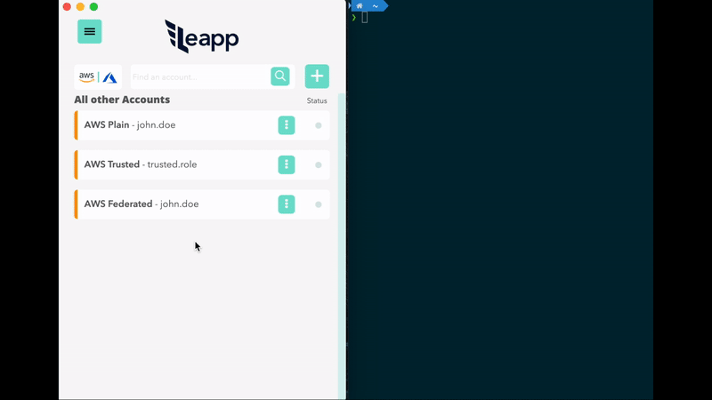

Leapp
=========
[](https://lgtm.com/projects/g/Noovolari/leapp/context:javascript)
- Website: [leapp.cloud](https://www.leapp.cloud/)
- Documentation Website: [docs.leapp.cloud](https://docs.leapp.cloud/)
- Roadmap: [Roadmap](https://github.com/Noovolari/leapp/discussions/178)
- Chat with us: [Slack](https://join.slack.com/t/noovolari/shared_invite/zt-opn8q98k-HDZfpJ2_2U3RdTnN~u_B~Q)


Leapp is a Cross-Platform Cloud access App, built on top of [Electron](https://github.com/electron/electron).

The App is designed to **manage and secure Cloud Access in multi-account environments.**


# Key features

> We Strongly believe that access information to Cloud in `~/.aws` or `~/.azure` files are not safe, and **[we prefer to store that information in an encrypted file managed by the system.](https://docs.leapp.cloud/contributing/system_vault/)**
> Credentials will be hourly rotated and accessible in those files only when they are needed, so only when Leapp is active.


- **Switch Cloud Profile in a click**

- **[Secure](https://docs.leapp.cloud/contributing/system_vault/) repository for your access data**

- **Multiple Cloud-Access [strategies](https://docs.leapp.cloud/use-cases/intro/)**

- **[No long-lived](https://docs.leapp.cloud/concepts/) credentials**

- **Generate and use sessions directly from [your aws Organization](https://docs.leapp.cloud/configuring-integration/configure-aws-single-sign-on-integration/)**

- **Connect EC2 instances straight away**

All the covered access methods can be found [here](https://docs.leapp.cloud/use-cases/intro/).




# Installation

- Verify that all [requirements](https://docs.leapp.cloud/installation/requirements/) are satisfied.
- Follow the [installation documentation](https://docs.leapp.cloud/installation/install-leapp/). 

# Contributing

Please read through our [contributing guidelines](.github/CONTRIBUTING.md) and [code of conduct](.github/CODE_OF_CONDUCT.md). Included are directions
for opening issues, coding standards, and notes on development.

Editor preferences are available in the [editor config](.editorconfig) for easy use in
common text editors. Read more and download plugins at [editorconfig.org](http://editorconfig.org).

# Developing

Development on Leapp can be done on Mac, Windows, or Linux as long as you have
[NodeJS](https://nodejs.org) and [Git](https://git-scm.com/). See the `.nvmrc` file located in the project for the correct Node version.

<details>
<summary>Initial Dev Setup</summary>

This repository is structured as a monorepo and contains many Node.JS packages. Each package has
its own set of commands, but the most common commands are available from the
root [`package.json`](package.json) and can be accessed using the `npm run ...` command. Here
are the only three commands you should need to start developing on the app.

```bash
# Install and Link Dependencies
npm install


# Start App without Live Reload
npm run electron-dev
```

If Electron is failing building the native Library `Keytar` just run before `npm run electron-dev`:
```bash
# Clear Electron and Keytar conflicts
npm run rebuild-keytar
```

</details>

<details>
<summary>Editor Requirements</summary>

You can use any editor you'd like, but make sure to have support/plugins for
the following tools:

- [ESLint](http://eslint.org/) – For catching syntax problems and common errors

</details>

# Our Sponsors

[](https://github.com/taimos)
[](https://github.com/aws)


# Documentation
Refer to the documentation [website](https://docs.leapp.cloud).

# Links
- [Glossary](.github/GLOSSARY.md): find other information about the system
- [Contributing](./.github/CONTRIBUTING.md): follow the guidelines if you'd like to contribute to the project
# License
[Mozilla Public License v2.0](https://github.com/Noovolari/leapp/blob/master/LICENSE)
