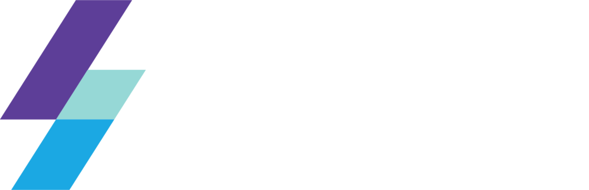
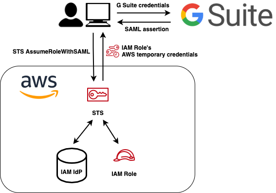
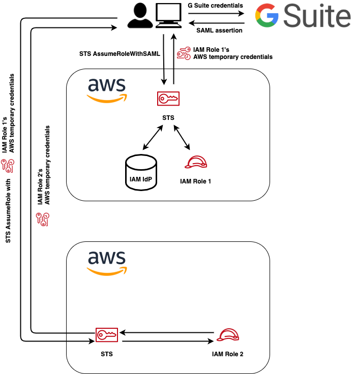
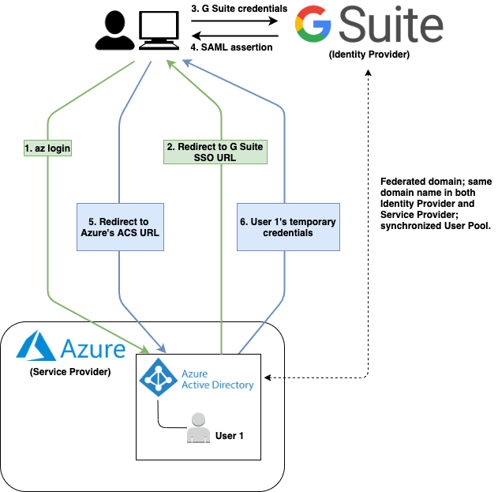

Leapp
=========

- Website: https://www.leapp.cloud/
- Roadmap: [Roadmap](https://github.com/Noovolari/leapp/projects/1)
- Tutorials: [Tutorials](#tutorials)

Leapp is your everyday companion to access your cloud; designed to work with multiple Identity Providers and Cloud Providers APIs, CLIs, and SDKs.
It's a software that securely stores your access information and generates temporary credential sets to access your cloud ecosystem from your local machine.

For example, while using the AWS CLI it may become annoying to switch to a different profile or use the --profile argument before issuing every command. Leapp lets you have a new set of credentials and give access to that account with a click.

# Key features

- **Switch account with a click**: Collect all your cloud accounts access data in a single place and connect straight away. Leverage cloud RBAC to impersonate your roles in a click, and don’t waste time manually manage or edit your credentials file.
- **Straight programmatic access via SSO**: Leverage your company identity to access your environment through federated single sign-on. No more credentials management. Leapp allows you to get to your cloud resources with your company email and password. Scroll down for our [supported use cases](#supported-cloud-providers).
- **Clean credentials file**: Ever wondered what someone can do by stealing your credentials file? We got you covered. We erase these files when you close Leapp and regenerate them when you open it! Leave your desk and get a coffee at ease.
- **Automatic credentials management**: Move freely across your multi-cloud environment as Leapp automatically manages your access credentials for you. It handles temporary keys generation, rotation, and auto-renew to comply with security best-practices.
- **Ease federation with truster accounts**: federating each account is a pain so why don’t use truster accounts to grant access easier and painlessly? We use your federated role as a gateway to all trusted roles in all other accounts! Seems great, isn’t it? See our [documentation](https://github.com/Noovolari/leapp/blob/master/.github/GLOSSARY.md#trusting) to get more info.

## Supported Cloud Providers
- **AWS** - :white_check_mark:
- **AZURE** - :white_check_mark:
- **GCP** - :construction:

## Supported Identity Providers
- **G Suite** - :white_check_mark:
- **AZURE AD** - :construction:
- **AWS SSO** - :construction:

# Installation

Get [here](https://github.com/Noovolari/leapp/releases/latest) the latest release.

To install the compiled version, choose the one for your **OS** and simply **double-click** on the executable.

# Tutorials

Here is a list of curated **tutorials** to **help you setup** your environment for Leapp. 

#### First access tutorial

- [First access to Leapp](.github/tutorials/FIRST_SETUP.md)

Other tutorials are grouped by Access Strategy.

#### AWS Plain Access

- [Create a Plain Strategy with Leapp](.github/tutorials/CREATE_PLAIN_ACCOUNT.md)

#### AWS Federated Access

*Federated Access Schema*

- Federation between G Suite and AWS
    - [G Suite Federation Setup](.github/tutorials/G_SUITE_FEDERATION_SETUP.md)
    - [AWS Federation Setup](.github/tutorials/AWS_FEDERATION_SETUP.md)
- [Enable role federated access](.github/tutorials/ENABLE_ROLE_FEDERATED_ACCESS.md)
- [Assign role to G Suite Principal](.github/tutorials/ASSIGN_ROLE_TO_G_SUITE_PRINCIPAL.md)
- [Create a Federated Strategy with Leapp](.github/tutorials/CREATE_FEDERATED_ACCOUNT.md)

#### AWS Truster Access

*Truster Access Schema Through Plain*

*Truster Access Schema Through Federated*

- [Create a Truster Strategy with Leapp](.github/tutorials/CREATE_TRUSTER_ACCOUNT.md)

#### Azure Access

*Azure Access Schema*

- [Create an Azure Strategy with Leapp](.github/tutorials/CREATE_AZURE_ACCOUNT.md)

# Quickstart

Leapp is a desktop application build in [Electron](https://www.electronjs.org/) + [Angular 8](https://angular.io/) that manage and rotate your credentials while keeping them secure by encrypting all the information and removing the credential file and closing the session when the program is closed.

- [Configure your SAML Application SSO URL](.github/tutorials/CONFIGURE_YOUR_SAML_APPLICATION_SSO_URL.md)
- [Manage Federated Accounts and Federated Roles](.github/tutorials/MANAGE_FEDERATED_ACCOUNTS_AND_FEDERATED_ROLES.md)
- [Manage Truster Accounts and Truster Roles](.github/tutorials/MANAGE_TRUSTER_ACCOUNTS_AND_TRUSTER_ROLES.md)
- [Manage Quick List](.github/tutorials/MANAGE_QUICK_LIST.md)

## Links

- [Glossary](.github/GLOSSARY.md): find other information about the system
- [Roadmap](https://github.com/Noovolari/leapp/projects/1): view our next steps and stay up to date
- [Contributing](./.github/CONTRIBUTING.md): follow the guidelines if you'd like to contribute to the project
- [Project Structure](./.github/PROJECT_STRUCTURE.md): check how we structured the project and where to find the files

## License

[Mozilla Public License v2.0](https://github.com/Noovolari/leapp/blob/master/LICENSE)
