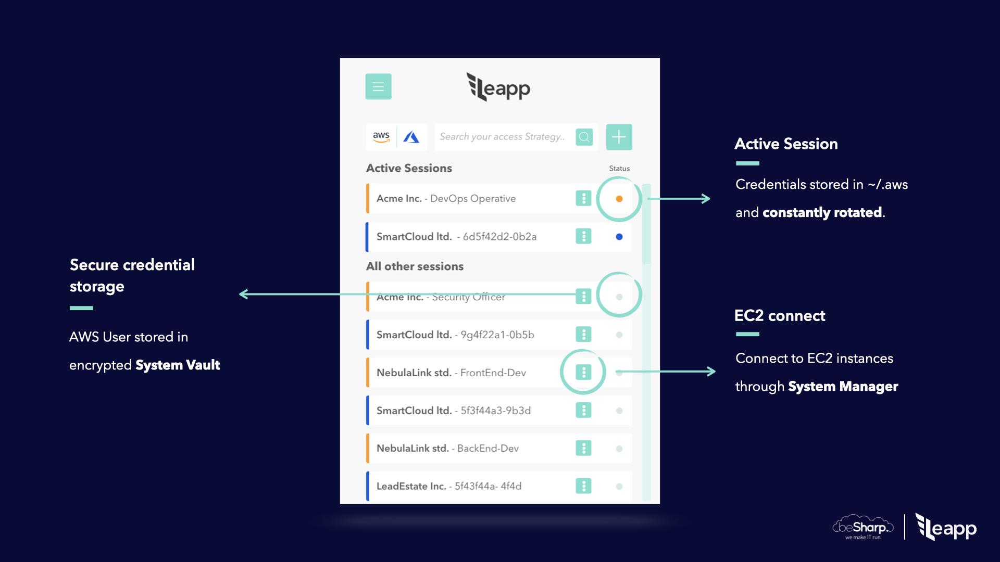
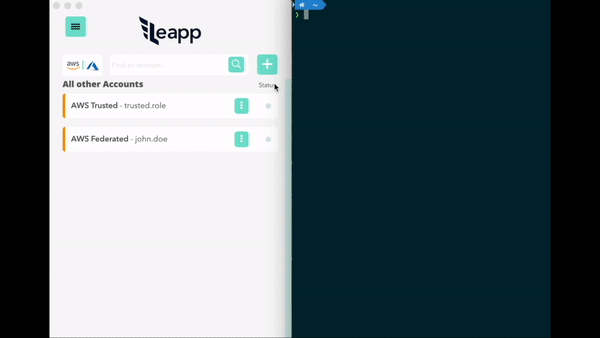
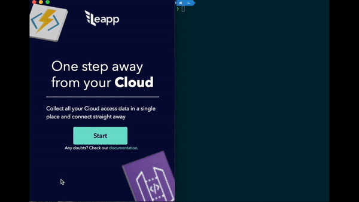
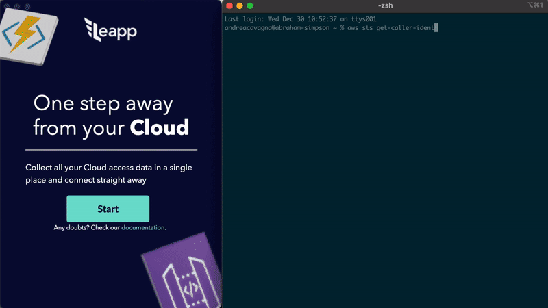
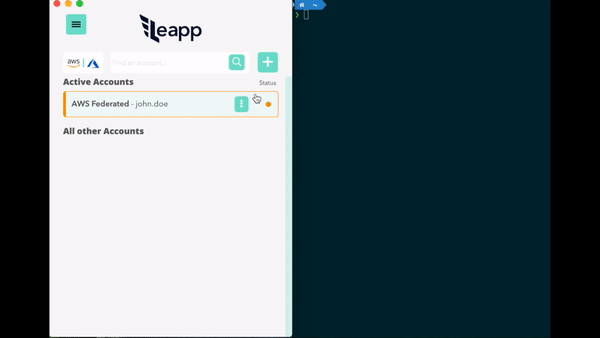
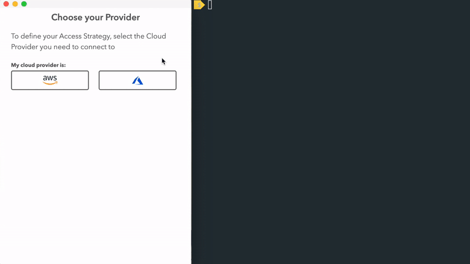

Leapp
=========
[](https://github.com/Noovolari/leapp/releases/latest)
- Website: https://www.leapp.cloud/
- Roadmap: [Roadmap](https://github.com/Noovolari/leapp/projects/1)
- Use Cases: [Use Cases](#use-cases)
- Chat with us: [Discord](https://discord.gg/wHh2kyK)


Leapp is a DevTool Desktop App designed to **manage and secure Cloud Access in multi-account environments.**

The App is designed to work with Cloud Providers APIs, CLIs, and SDKs.

It's a tool that securely [**stores your access information in a secure place**](.github/vault_strategy/strategy.md) and generates temporary credential sets to access your Cloud from your local machine.

> We Strongly believe that access information to Cloud in `~/.aws` or `~/.azure` files are not safe, and we prefer to store that information in an encrypted file managed by the system. 
> Credentials will be hourly rotated and accessible in those files only when they are needed, so only when Leapp is active.


# Table of Contents

- [Key features](#key-features)
- [Installation](#installation)
- [Use Cases](#use-cases)
  * [AWS Plain Access](#aws-plain-access)
  * [AWS Federated Access](#aws-federated-access)
  * [AWS SSO](#aws-sso)
  * [AWS Truster Access](#aws-truster-access)
  * [Azure Access](#azure-access)
- [Supported Providers](#supported-providers)
  * [Cloud Providers](#cloud-providers)
  * [Identity Providers](#identity-providers)
- [Documentation](#documentation)  
- [Logs](#logs)
- [Links](#links)
- [License](#license)


# Key features
### Switch account in a click
No need to manage the credentials file. Get connected to your accounts in a click. 
### Secure repository for your access data
Protect your cloud accounts access data in the system vault and connect straight away.
### Multiple cloud access strategies
Connect with federated single sign-on, roles or static credentials. Check [here](#supported-providers) what's currently supported.
### No static credentials
Generate and inject only temporary credentials to comply with security best-practices.
### Generate and use sessions directly from your AWS Organizations
Access to multiple AWS accounts with [AWS single sign-on](https://aws.amazon.com/single-sign-on/) access.
### Direct infrastructure connection
Connect to your virtual machines with AWS System Manager.


# Installation
Get [here](https://github.com/Noovolari/leapp/releases/latest) the latest release.

# Use Cases
Our use cases are hereby presented to give you a hint on how Leapp can be of help to depend on the type of setup 
you have in your company and what kind of credentials you need to get.

## AWS Plain Access
Store AWS IAM User's Access Keys in your System Vault through Leapp. 
Leapp automatically manages **Access Key ID** and **Secret Access Key** in your AWS credentials, 
generating temporary credentials for them.

**No credentials** are stored in Leapp. 

Please see [Vault strategy](https://www.github.com/Noovolari/leapp/wiki/vault-strategy) for more information.



See setup [tutorial](https://www.github.com/Noovolari/leapp/wiki/tutorials)

*Note: it's possible to assign an MFA device to a plain session. Please see [MFA section](#multi-factor-authentication) for more details.*

## AWS Federated Access
Leverage company identity to access environment through federated single sign-on. 
Federation is established between **G Suite** and **AWS**. No more AWS credentials 
management is needed. Leapp allows you to get to cloud resources with company email and password.



See setup [tutorial](https://www.github.com/Noovolari/leapp/wiki/tutorials)

## AWS SSO
AWS SSO let create and manage user identities in AWS SSO’s identity store, easily 
connect to existing identity source, including Microsoft Active Directory, Okta Universal Directory, 
and Azure AD. Finally, trough Leapp, Developers have access to all their sessions from one tool.


See setup [tutorial](https://www.github.com/Noovolari/leapp/wiki/tutorials)

## AWS Truster Access
Federating each account is difficult so use truster accounts to grant access easier and painlessly.
We use federated role as a gateway to all trusted roles in all other AWS accounts.
In this access strategy a **truster role** is assumed by a **federated role**.



See setup [tutorial](https://www.github.com/Noovolari/leapp/wiki/tutorials)

*Note: it's possible to apply MFA to a truster session by setting it on the plain account it relies on. Please see [MFA section](#multi-factor-authentication) for more details.*

## Azure Access
Use Leapp to do Single Sign On with G Suite on Azure to get access to your 
**Subscriptions**. In this use case is **mandatory** to have defined a Federation 
between Google and Azure. Leapp manage the login process for you to have Azure CLI 
ready to be used.



See setup [tutorial](https://www.github.com/Noovolari/leapp/wiki/tutorials)

# Supported Providers
## Cloud Providers
- **AWS** - :white_check_mark:
- **AZURE** - :white_check_mark:
- **GCP** - :soon:
## Identity Providers
- **G Suite to AWS** - :white_check_mark:
- **G Suite to Azure** - :white_check_mark:
- **AZURE AD to Azure** - :white_check_mark:
- **AZURE AD to AWS** - :soon:
- **AWS SSO** - :white_check_mark:

# Logs
By default, Leapp writes logs to the following locations:

- on Linux: `~/.config/Leapp/logs/log.log`
- on macOS: `~/Library/Logs/Leapp/log.log`
- on Windows: `%USERPROFILE%\\AppData\\Roaming\\Leapp\\log.log`
Logs are structured in the following way:
```
[YYYY-MM-DD HH:mm:ss.mmm] [LEVEL] [rendered/system] [COMPONENT] MESSAGE {Useful Object / Stacktrace Err Object}
```
*Note: please always add logs whenever possible to any issue you want to fill to enable the team identify the problem quickly*

## Documentation
Here you can find our [documentation](https://github.com/Noovolari/leapp/wiki).

## Links
- [Glossary](.github/GLOSSARY.md): find other information about the system
- [Roadmap](https://github.com/Noovolari/leapp/projects/1): view our next steps and stay up to date
- [Contributing](./.github/CONTRIBUTING.md): follow the guidelines if you'd like to contribute to the project
- [Project Structure](./.github/PROJECT_STRUCTURE.md): check how we structured the project and where to find the files
## License
[Mozilla Public License v2.0](https://github.com/Noovolari/leapp/blob/master/LICENSE)
