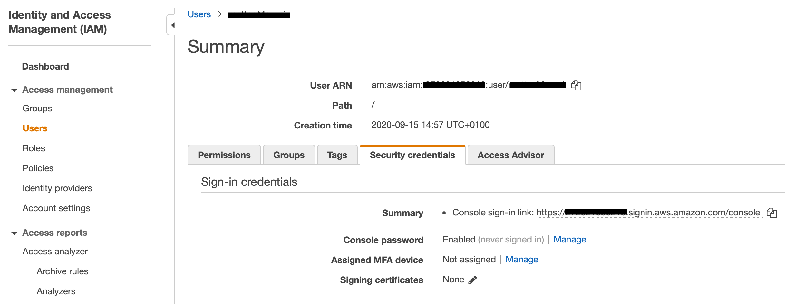
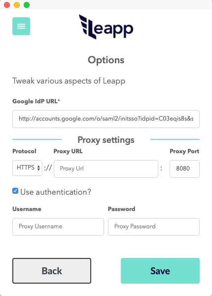

Leapp
=========
[](https://github.com/Noovolari/leapp/releases/latest)
- Website: https://www.leapp.cloud/
- Roadmap: [Roadmap](https://github.com/Noovolari/leapp/projects/1)
- Use Cases: [Use Cases](#use-cases)
- Chat with us: [Discord](https://discord.gg/wHh2kyK)


Leapp is a DevTool Desktop App designed to **manage and secure Cloud Access in multi-account environments.**

The App is designed to work with Cloud Providers APIs, CLIs, and SDKs.

It's a tool that securely [**stores your access information in a secure place**](.github/vault_strategy/strategy.md) and generates temporary credential sets to access your Cloud from your local machine.

> We Strongly believe that access information to Cloud in `~/.aws` or `~/.azure` files are not safe, and we prefer to store that information in an encrypted file managed by the system. 
> Credentials will be hourly rotated and accessible in those files only when they are needed, so only when Leapp is active.


# Table of Contents

- [Key features](#key-features)
- [Installation](#installation)
- [Use Cases](#use-cases)
  * [AWS Plain Access](#aws-plain-access)
  * [AWS Federated Access](#aws-federated-access)
  * [AWS SSO](#aws-sso)
  * [AWS Truster Access](#aws-truster-access)
  * [Azure Access](#azure-access)
- [Supported Providers](#supported-providers)
  * [Cloud Providers](#cloud-providers)
  * [Identity Providers](#identity-providers)
- [Rotating Credentials](#rotating-credentials)
- [Multi-Factor Authentication](#multi-factor-authentication)
  * [Setup MFA in AWS](#setup-mfa-in-aws)
    + [MFA restricted access](#mfa-restricted-access)
  * [Setup MFA in Leapp](#setup-mfa-in-leapp)
  * [Temporary credentials durations](#temporary-credentials-durations)
    + [Plain and Truster session token management](#plain-and-truster-session-token-management)
- [HTTP/HTTPS in-app proxy](#http-https-in-app-proxy)
    + [Note for Azure Sessions](#note-for-azure-sessions)
- [Logs](#logs)
- [Quick List](#quick-list)
  * [Links](#links)
  * [License](#license)


# Key features
### Switch account in a click
No need to manage the credentials file. Get connected to your accounts in a click. 
### Secure repository for your access data
Protect your cloud accounts access data in the system vault and connect straight away.
### Multiple cloud access strategies
Connect with federated single sign-on, roles or static credentials. Check [here](#supported-providers) what's currently supported.
### No static credentials
Generate and inject only temporary credentials to comply with security best-practices.
### Direct infrastructure connection
Connect to your virtual machines with AWS System Manager.


# Installation
Get [here](https://github.com/Noovolari/leapp/releases/latest) the latest release.

# Use Cases
Our use cases are hereby presented to give you a hint on how Leapp can be of help to depend on the type of setup 
you have in your company and what kind of credentials you need to get.

## AWS Plain Access
Store AWS IAM User's Access Keys in your System Vault through Leapp. 
Leapp automatically manages **Access Key ID** and **Secret Access Key** in your AWS credentials, 
generating temporary credentials for them.

**No credentials** are stored in Leapp. 

Please see [Vault strategy](.github/vault_strategy/strategy.md) for more information.


See setup [tutorial](.github/tutorials/TUTORIALS.md)

*Note: it's possible to assign an MFA device to a plain session. Please see [MFA section](#multi-factor-authentication) for more details.*

## AWS Federated Access
Leverage company identity to access environment through federated single sign-on. 
Federation is established between **G Suite** and **AWS**. No more AWS credentials 
management is needed. Leapp allows you to get to cloud resources with company email and password.


See setup [tutorial](.github/tutorials/TUTORIALS.md)

## AWS SSO


## AWS Truster Access
Federating each account is difficult so use truster accounts to grant access easier and painlessly.
We use federated role as a gateway to all trusted roles in all other AWS accounts.
In this access strategy a **truster role** is assumed by a **federated role**.


See setup [tutorial](.github/tutorials/TUTORIALS.md)

*Note: it's possible to apply MFA to a truster session by setting it on the plain account it relies on. Please see [MFA section](#multi-factor-authentication) for more details.*

## Azure Access
Use Leapp to do Single Sign On with G Suite on Azure to get access to your 
**Subscriptions**. In this use case is **mandatory** to have defined a Federation 
between Google and Azure. Leapp manage the login process for you to have Azure CLI 
ready to be used.


See setup [tutorial](.github/tutorials/TUTORIALS.md)

# Supported Providers
## Cloud Providers
- **AWS** - :white_check_mark:
- **AZURE** - :white_check_mark:
- **GCP** - :soon:
## Identity Providers
- **G Suite to AWS** - :white_check_mark:
- **G Suite to Azure** - :white_check_mark:
- **AZURE AD to Azure** - :white_check_mark:
- **AZURE AD to AWS** - :soon:
- **AWS SSO** - :white_check_mark:

# Rotating Credentials
Leapp is created with security in mind: that is, **NO** credentials are saved in our system whatsoever. 
Nor in code neither in our configuration file. Everytime a credential is generated 
is **temporary**, and **no long-term ones are ever saved** in plain accessible files or locations.


# Multi-Factor Authentication
Leapp support Multi-Factor Authentication for **AWS Plain and Truster** access strategies. 
The system will ask for the **MFA device ARN** provided by AWS when creating/editing 
a Plain session, which corresponds to an **AWS IAM User**.

## Setup MFA in AWS
To enable MFA for a specific IAM User, you need to assign an MFA device to it. Move to 
the Security Credentials tab within the IAM User's Summary. 



Once there, you should be able to find the *Assigned MFA device* configuration, from which a new MFA device can
be assigned to the user.
MFA protects access to your AWS Account prompting for a token when you try to start the
Leapp session.

### MFA restricted access
**MFA device ARN** is *necessary*, not *sufficient*, condition to protect access to your cloud resources. 
User or Apps can do operations on cloud resources without being prompted for an MFA code. To enforce MFA 
for specific actions described in a Role's policy, a `"Condition": {"Bool": {"aws:MultiFactorAuthPresent": "true"}}` 
statement must be present for action `"Action": "sts:AssumeRole"` in the role policy.

## Setup MFA in Leapp
To assign an MFA device to a **plain account** just insert a *physical device's serial number*, or an *MFA device ARN* in 
the corresponding field of plain strategy's form. The device is then associated with that specific session, and the **MFA token** will be prompted
when the session starts.

*Note 1: if you need to remove MFA from a plain session, just edit it and leave the field blank.*
*Note 2: when you set up a truster account from a plain session with MFA enabled, **Leapp** inherently associates MFA checks to it.*

## Temporary credentials durations
There are 2 **environment variables** contained in Leapp which define how a session is managed:
* *session duration*: defines **how often** the system will refresh your **temporary** credentials. [defaults to 1200s / 20min]
* *session token duration* defines **how long** the **session token** will be used for each *session duration* refresh action. [defaults to 36000s / 10h] 

### Plain and Truster session token management
**Plain session**: newly generated session tokens are valid for 10 hours, which corresponds to the value specified in the *session token duration* environment variable.
Leapp stores session tokens inside your OS's specific vault, from which they are retrieved as long as they're valid.
Every 20 minutes - i.e. the value specified in the *session duration* environment variable - Leapp refreshes the credential file with a valid session token, or a newly generated one.
If you have enabled MFA for a Plain session, Leapp will prompt for an MFA token only if the session token is no more valid.

**Truster session from Plain**: when you create a Truster session, you've to define the Federated Role or Plain IAM User that will *assume* the Truster Role specified in the Truster session.

If the Truster Role is assumed by a Plain IAM User, the following two steps will be covered.
- A session token, related to the Plain IAM User, will be generated; this session token will be managed by Leapp in the same way described in **Plain session**.
- The session token is used to assume the Truster Role, generating new temporary credentials that will be written in the credentials file and refreshed every 20 minutes.

If the Truster Role is assumed by a Federated Role, the following two steps will be covered.
- A set of temporary credentials - associated to the Federated Role - will be generated through SAML federated Single Sign-On; 
in particular, the Security Token Service's AssumeRoleWithSAML API is called, passing in the SAML assertion returned by the Identity Provider.
- The temporary credentials - associated to the Federated Role - are used to assume the Truster Role, obtaining new temporary credentials associated to the Truster Role.
This set of temporary credentials is used to refresh the credentials file.

# HTTP/HTTPS in-app proxy
Leapp allows for HTTP/HTTPS protocols, specifying a proxy server to which the in-app requests are sent. Both authenticated and non authenticated proxy are supported. In the option panel you can configure protocol, url, port, and authentication information. See image below




### Note for Azure Sessions
Leapp uses Azure CLI to authenticate the **User** to retrieve the tokens for the session. This means that you **must** configure your Azure proxy settings locally to allow the Azure CLI to do ```az login``` properly, as Leapp is no responsible for that.
This extends generally to all CLIs and external tools that need to communicate over Internet behind a proxy configuration.

# Logs
By default, Leapp writes logs to the following locations:

- on Linux: `~/.config/Leapp/logs/log.log`
- on macOS: `~/Library/Logs/Leapp/log.log`
- on Windows: `%USERPROFILE%\\AppData\\Roaming\\Leapp\\log.log`
Logs are structured in the following way:
```
[YYYY-MM-DD HH:mm:ss.mmm] [LEVEL] [rendered/system] [COMPONENT] MESSAGE {Useful Object / Stacktrace Err Object}
```
*Note: please always add logs whenever possible to any issue you want to fill to enable the team identify the problem quickly*

# Quick List
Quick list is the component in Leapp that helps you manage all your sessions
together. You'll probably pass most of your time here so this is a quick 
list tutorial on how it works!
- [Manage Quick List](.github/tutorials/MANAGE_QUICK_LIST.md)
## Links
- [Glossary](.github/GLOSSARY.md): find other information about the system
- [Roadmap](https://github.com/Noovolari/leapp/projects/1): view our next steps and stay up to date
- [Contributing](./.github/CONTRIBUTING.md): follow the guidelines if you'd like to contribute to the project
- [Project Structure](./.github/PROJECT_STRUCTURE.md): check how we structured the project and where to find the files
## License
[Mozilla Public License v2.0](https://github.com/Noovolari/leapp/blob/master/LICENSE)
