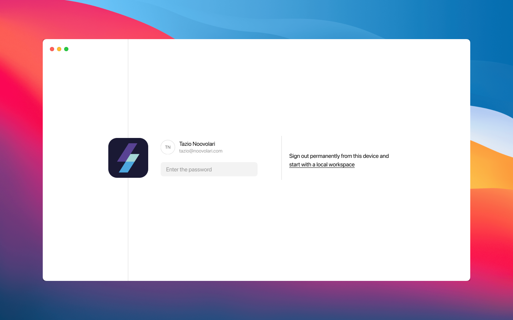

## Why Leapp Pro?
Leapp Pro enable Users to protect their Cloud access with Username and password.

With Leapp Pro you can **back up and synchronize** your Leapp workspace and access to any device you want without losing your access configurations.

### Getting started guide
- [Sign up to Leapp Pro](/leapp-pro/getting-started/sign-up/)
- [Sign in to Leapp Pro](/leapp-pro/getting-started/sign-in)
- [Lock your Leapp Pro Workspace](/leapp-pro/getting-started/lock)

### Security and syncronization

Once you updgrade your Plan to Leapp Pro, your local Workspace will be moved to the Pro Workspace. 
All the data inside your workspace are secured with [end-to-end encryption](/security/zero-knowledge) through your [Master password](/leapp-pro/security-and-password/).

