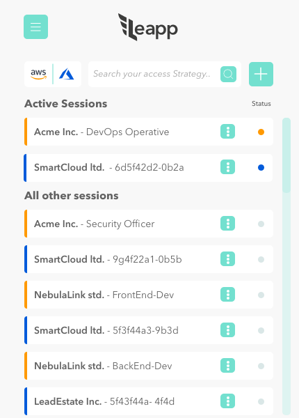

## Why Using AWS SSO with Leapp
When using AWS SSO directly with tools like AWS CLI V2 a specific profile is defined for the
user when using *aws configure*. Because of that you lose compatibility with lots of tools
and libraries that uses the standard profile. Leapp believes that tools and software must
always use simple, flat, short-lived credentials, avoiding to leave any sensitive information
in the profile. That is why Leapp **takes care for you** of the authentication process, no matter
what strategy do you plan to use.

Because of this, Leapp allows AWS SSO to be compatible with AWS CLI V2 and many others libraries out
there, because at the end of its process you'll have plain temporary credentials to use.

## How Leapp integrates with AWS SSO under the hood

The Auth flow in AWS SSO is made up with OIDC and is divided in three different steps:

1. [RegisterClient](https://docs.aws.amazon.com/singlesignon/latest/OIDCAPIReference/API_RegisterClient.html)
2. [StartDeviceAuthorization](https://docs.aws.amazon.com/singlesignon/latest/OIDCAPIReference/API_StartDeviceAuthorization.html)
3. [CreateToken](https://docs.aws.amazon.com/singlesignon/latest/OIDCAPIReference/API_CreateToken.html)

> *Note: CREDENTIALS ARE NOT NEEDED FOR THOSE THREE CALLS*

The first thing we have to do is to register a local client.

> The AWS SSO OIDC service currently implements only the portions of the OAuth 2.0 Device Authorization Grant standard ([https://tools.ietf.org/html/rfc8628](https://tools.ietf.org/html/rfc8628)) that are necessary to enable SSO authentication with the AWS CLI. Support for other OIDC flows frequently needed for native applications, such as Authorization Code Flow (+ PKCE), is planned in future releases.

#### RegisterClient

As soon as the **aws sso** button is clicked, the RegisterClient Api will be invoked.

```json
aws sso-oidc register-client --client-name leapp --client-type public
```

*notes: public is the only client type available at the moment.*

it will generate a response like the one below:

```json
{
    "clientId": "ClhqC9rDzjY43Nh0nYEL-2V1LXdlc3QtMQ",
    "clientSecret": "eyJraWQiOiJrZXktMTU2Njk2ODAxMyIsImFsZyI6IkhTMzg0In0.eyJzZXJpYWxpemVkIjoie1wiZXhwaXJlZFwiOmZhbHNlLFwiY2xpZW50SWRcIjp7XCJ2YWx1ZVwiOlwiQ2xocUM5ckR6alk0M05oMG5ZRUwtMlYxTFhkbGMzUXRNUVwifSxcInRlbmFudElkXCI6bnVsbCxcImNsaWVudE5hbWVcIjpcImxlYXBwLXRlc3RcIixcImNsaWVudFR5cGVcIjpcIlBVQkxJQ1wiLFwidGVtcGxhdGVBcm5cIjpudWxsLFwidGVtcGxhdGVDb250ZXh0XCI6bnVsbCxcImV4cGlyYXRpb25UaW1lc3RhbXBcIjoxNjExNjc0Njg2Ljg0MTAwMDAwMCxcImNyZWF0ZWRUaW1lc3RhbXBcIjoxNjAzODk4Njg2Ljg0MTAwMDAwMCxcInVwZGF0ZWRUaW1lc3RhbXBcIjoxNjAzODk4Njg2Ljg0MTAwMDAwMCxcImNyZWF0ZWRCeVwiOm51bGwsXCJ1cGRhdGVkQnlcIjpudWxsLFwic3RhdHVzXCI6bnVsbCxcImluaXRpYXRlTG9naW5VcmlcIjpudWxsLFwiZW50aXRsZWRSZXNvdXJjZUlkXCI6bnVsbCxcImVudGl0bGVkUmVzb3VyY2VDb250YWluZXJJZFwiOm51bGwsXCJleHRlcm5hbElkXCI6bnVsbH0ifQ.s5fnQhh7J70RGxcUsSUvI08ptEr8dqIWPQRVAq0DFGrdsqea6d411ExkKhbGJRlK",
    "clientIdIssuedAt": 1603898686,
    "clientSecretExpiresAt": 1611674686
}
```

By decoding the Client secret you will see:

```json
{
  "expired": false,
  "clientId": {
    "value": "R-j5yN-4-TPNs...tMQ"
  },
  "clientName": "my-client",
  "clientType": "PUBLIC",
  "templateArn": null,
  "templateContext": null,
  "expirationTimestamp": 1594932567.612,
  "createdTimestamp": 1587156567.612,
  "updatedTimestamp": 1587156567.612,
  "createdBy": null,
  "updatedBy": null
}
```

We have to locally save those info and pass them into the next call.

#### StartDeviceAuthorization

In order to make this call the user of Leapp need to have registered into AWS SSO and provide a valid start-url, that is the **portal url**


Having a valid OIDC client registration we can now initiate the device authorization flow using the [StartDeviceAuthorization](https://docs.aws.amazon.com/singlesignon/latest/OIDCAPIReference/API_StartDeviceAuthorization.html) API action.

```jsx
aws sso-oidc start-device-authorization 
--client-id mVZBEoa-gUBj8nugHZUIsWV1LXdlc3QtMQ 
--client-secret eyJraWQiOiJrZXktMTU2Njk2ODAxMyIsImFsZyI6IkhTMzg0In0.eyJzZXJpYWxpemVkIjoie1wiZXhwaXJlZFwiOmZhbHNlLFwiY2xpZW50SWRcIjp7XCJ2YWx1ZVwiOlwibVZaQkVvYS1nVUJqOG51Z0haVUlzV1YxTFhkbGMzUXRNUVwifSxcInRlbmFudElkXCI6bnVsbCxcImNsaWVudE5hbWVcIjpcImxlYXBwXCIsXCJjbGllbnRUeXBlXCI6XCJQVUJMSUNcIixcInRlbXBsYXRlQXJuXCI6bnVsbCxcInRlbXBsYXRlQ29udGV4dFwiOm51bGwsXCJleHBpcmF0aW9uVGltZXN0YW1wXCI6MTYxMTU2ODM0MS45MDkwMDAwMDAsXCJjcmVhdGVkVGltZXN0YW1wXCI6MTYwMzc5MjM0MS45MDkwMDAwMDAsXCJ1cGRhdGVkVGltZXN0YW1wXCI6MTYwMzc5MjM0MS45MDkwMDAwMDAsXCJjcmVhdGVkQnlcIjpudWxsLFwidXBkYXRlZEJ5XCI6bnVsbCxcInN0YXR1c1wiOm51bGwsXCJpbml0aWF0ZUxvZ2luVXJpXCI6bnVsbCxcImVudGl0bGVkUmVzb3VyY2VJZFwiOm51bGwsXCJlbnRpdGxlZFJlc291cmNlQ29udGFpbmVySWRcIjpudWxsLFwiZXh0ZXJuYWxJZFwiOm51bGx9In0.nyRt2ELVoiBh95GiZ_Igzzsn4DkzwfiU446c0lvuS9yqJe5Fk2Ra_tV-htKetQH8 
--start-url [https://u](https://awscli.amazonaws.com/v2/documentation/api/latest/reference/sso-oidc/start-device-authorization.html)rltoSSOendpoint
```

That will produce a response like this:

```json
{
  "deviceCode": "8Acq...DUg",
  "expiresIn": 600,
  "interval": 1,
  "userCode": "RPXP-JSQA",
  "verificationUri": "https://device.sso.eu-central-1.amazonaws.com/",
  "verificationUriComplete": "https://device.sso.eu-central-1.amazonaws.com/?user_code=RPXP-JSQA"
}
```

Where:

- **[deviceCode](https://docs.aws.amazon.com/singlesignon/latest/OIDCAPIReference/API_StartDeviceAuthorization.html#API_StartDeviceAuthorization_ResponseSyntax):** The short-lived code that is used by the device when polling for a session token.
- **[expiresIn](https://docs.aws.amazon.com/singlesignon/latest/OIDCAPIReference/API_StartDeviceAuthorization.html#API_StartDeviceAuthorization_ResponseSyntax):** Indicates the number of seconds in which the verification code will become invalid.
- **[interval](https://docs.aws.amazon.com/singlesignon/latest/OIDCAPIReference/API_StartDeviceAuthorization.html#API_StartDeviceAuthorization_ResponseSyntax):** Indicates the number of seconds the client must wait between attempts when polling for a session.
- **[userCode](https://docs.aws.amazon.com/singlesignon/latest/OIDCAPIReference/API_StartDeviceAuthorization.html#API_StartDeviceAuthorization_ResponseSyntax):** A one-time user verification code. This is needed to authorize an in-use device.
- **[verificationUri](https://docs.aws.amazon.com/singlesignon/latest/OIDCAPIReference/API_StartDeviceAuthorization.html#API_StartDeviceAuthorization_ResponseSyntax):** The URI of the verification page that takes the `userCode` to authorize the device.
- **[verificationUriComplete](https://docs.aws.amazon.com/singlesignon/latest/OIDCAPIReference/API_StartDeviceAuthorization.html#API_StartDeviceAuthorization_ResponseSyntax):** An alternate URL that the client can use to automatically launch a browser. This process skips the manual step in which the user visits the verification page and enters their code.

In order to verify this device, **Leapp** will prompt you to the LOGIN PAGE and the verification code page, by opening a web browser with the `verificationUriComplete`

After the verification of the device we can now call the `CreateToken` API

#### CreateToken

Having the `userCode`and `deviceCode`values we can now us the [CreateToken](https://docs.aws.amazon.com/singlesignon/latest/OIDCAPIReference/API_CreateToken.html) API action to obtain a device access token. However, before we can request any tokens we need to open the `verificationUriComplete` URL in a web browser, complete authentication and provide authorization. At this point the end-user has to provide personal credentials in order to authenticate himself, for example by entering his username, password and maybe also has to provide multi factory authentication (MFA) credentials.

```jsx
curl -X POST https://oidc.eu-central-1.amazonaws.com/token -d 
'{"clientId": "R-j5yN-4-TPNs...tMQ", "clientSecret": "eyJr...x74", "deviceCode": "8Acq...DUg", "grantType": "urn:ietf:params:oauth:grant-type:device_code"}'
```

If everything worked out as expected, the token endpoint will return a valid accessToken, which we later can use with the **AWS SSO Portal API** to obtain temporary AWS credentials using the GetRoleCredentials action.

**The returned tokens are valid for 8 hours.**

This API call is region sensible, so we have to extract the region from the `verificationUriComplete` url with a RegEx!

With this token we can now call the [AWS SSO Portal API](https://docs.aws.amazon.com/singlesignon/latest/PortalAPIReference) to autogenerate sessions in Leapp.

#### AWS SSO Portal API

In order to fill the session available with AWS SSO we have to use those APIs

The following actions are supported:

- [GetRoleCredentials](https://docs.aws.amazon.com/it_it/singlesignon/latest/PortalAPIReference/API_GetRoleCredentials.html)
- [ListAccountRoles](https://docs.aws.amazon.com/it_it/singlesignon/latest/PortalAPIReference/API_ListAccountRoles.html)
- [ListAccounts](https://docs.aws.amazon.com/it_it/singlesignon/latest/PortalAPIReference/API_ListAccounts.html)
- [Logout](https://docs.aws.amazon.com/it_it/singlesignon/latest/PortalAPIReference/API_Logout.html)

and in order to complete this action we need scan for account and roles inside them.

#### ListAccounts

Lists all AWS accounts assigned to the user. These AWS accounts are assigned by the administrator of the account.

```bash
GET /assignment/accounts?max_result=maxResults&next_token=nextToken HTTP/1.1
x-amz-sso_bearer_token: accessToken
```

- **[accessToken](https://docs.aws.amazon.com/singlesignon/latest/PortalAPIReference/API_ListAccounts.html#API_ListAccounts_RequestSyntax):** The token issued by the `CreateToken` API call. **Required: Yes**
- **[maxResults](https://docs.aws.amazon.com/singlesignon/latest/PortalAPIReference/API_ListAccounts.html#API_ListAccounts_RequestSyntax):** This is the number of items clients can request per page. **Valid Range: Minimum value of 1. Maximum value of 100.**
- **[nextToken](https://docs.aws.amazon.com/singlesignon/latest/PortalAPIReference/API_ListAccounts.html#API_ListAccounts_RequestSyntax):**  When requesting subsequent pages, this is the page token from the previous response output. **Required: NO**

**RESPONSE**

```json
{
   "accountList": [ 
      { 
         "accountId": "string",
         "accountName": "string",
         "emailAddress": "string"
      }
   ],
   "nextToken": "string"
}
```

The following data is returned in JSON format by the service.

- **[accountList](https://docs.aws.amazon.com/singlesignon/latest/PortalAPIReference/API_ListAccounts.html#API_ListAccounts_ResponseSyntax):** A paginated response with the list of account information and the next token if more results are available.
  - **accountId:** The identifier of the AWS account that is assigned to the user.
  - **accountName**The display name of the AWS account that is assigned to the user.
  - **emailAddress**The email address of the AWS account that is assigned to the user. Length

For each account retrieved by this API we need to check all the possible roles inside it.

#### ListAccountRoles
[ListAccountRoles](https://docs.aws.amazon.com/it_it/singlesignon/latest/PortalAPIReference/API_ListAccountRoles.html)

```json
aws sso list-account-roles --access-token eyJlbmMiOiJBMjU2R0NNIiwidGFnIjoiT25ZVUUxVFdOTkJPTHBlXyIsImFsZyI6IkEyNTZHQ01LVyIsIml2IjoiTlN6OGZhX3R5OUlTQ2pDSCJ9.AYABeE2XhZfXOo0AQH4b8xBx2IcAHwABABBEYXRhUGxhbmVTZXNzaW9uAAlQZXJlZ3JpbmUAAQAHYXdzLWttcwBLYXJuOmF3czprbXM6ZXUtd2VzdC0xOjU2ODkwNzQ4NjgzOTprZXkvZjgxOTE5ODYtODUxMi00MjUxLWE2OGItZjA1ZDc4NzNjY2MwALgBAgEAeJu9skq4zE2ey9fc15hIacoXwiFFMAppCV0W0rSVkM8-AfyfQxekoSqPhi7I-4NV30sAAAB-MHwGCSqGSIb3DQEHBqBvMG0CAQAwaAYJKoZIhvcNAQcBMB4GCWCGSAFlAwQBLjARBAxmhCL0DkKsDKDXCOACARCAO3Eve3w-RA7Qhr2OXf2rIzq27GqRNnym4mKIr1GRApaqQg045HyPCu8sOPVAJ5hNkuozdXFEyLWczHixAgAAAAAMAAAQAAAAAAAAAAAAAAAAAF7LbxztBp6QTtJLUfx0lz______AAAAAQAAAAAAAAAAAAAAAQAAACCLZim2-nRmKQ1xBgn6dyEcIYkErQ3JrZD3xH2QVJWUzbKlF9iq4MY_GHL9IqjFzVc.SEOxHOT20ShnIeWq.i5iBKVf-UnQQxODhm9wr_HNfZVsr0vfp7afk0DXWMyom41khUS5eH8-i8K6kqZSxhxsyX6Pf502c-h0iIGYjZZEZ8jvoYnYTr900w8mjNAP1G1r-6gpqLSBw8wgEe194VfPmbMP6lL534fAwQeqQBBvUjDgCGsUgn3SniGXeTR-x7khc01Mvf6ocHAvkjAsdz3s0zsXjZDUsCId8XlWZaeapsJ9_JGOx_UmzhGeMY96JtwWcRKjGLOVaT2E8rkU32RZwgwWQGkTpLI75_IWlsfgj69nDpUYc65AsJHk0vywa7xbS9F_oYrgAzqUPBPbc8WTxOSejljCpefOjSSBRkzuTFw9YKhDOs4G_gS6pg-LFFN-WVIYuLAELRalZspk3WeTyUsJK_aFxUnY3sEUzEqF8TWMIK8AXKW0m8fBI8-zuzJvmVrYdcnf6u2oyd-Q_m3sxm2va1Ec_cKYPWUtLOp8.ZCp-zED2Sv2nZEpteo-dHw --account-id 198863347786 
```

Response:

```json
{
    "roleList": [
        {
            "roleName": "ViewOnlyAccess",
            "accountId": "198863347786"
        }
    ]
}
```

After that for each pair of Account and role found we will add an AWS session that is available to get the correct credentials.



#### GetRoleCredentials

Having a valid access token, we can use the [AWS SSO Portal API](https://docs.aws.amazon.com/singlesignon/latest/PortalAPIReference) to obtain temporary AWS credentials using the [GetRoleCredentials](https://docs.aws.amazon.com/singlesignon/latest/PortalAPIReference/API_GetRoleCredentials.html) action.

```bash
curl 'https://portal.sso.eu-central-1.amazonaws.com/federation/credentials?account_id=999999999999&role_name=MyIamRoleName' -H 'x-amz-sso_bearer_token: eyJl...Blw'
```

Which will then provide us with temporary AWS session credentials, which by default are valid for 12 hours.

```json
{
  "roleCredentials": {
    "accessKeyId": "ASIA...Z3XM",
    "secretAccessKey": "+t6UnVLWia...hFOzGL",
    "sessionToken": "IQoJb3JpZ2lu...dK6",
    "expiration": 1587361828000
  }
}
```

We've tried several additional query parameters (`session_duration`, `duration_seconds`, …) to figure out whether one can choose a shorter session duration, but it looks like 12 hours is all you can get. While [AWS STS API](https://docs.aws.amazon.com/STS/latest/APIReference/Welcome.html)’s actions like [AssumeRole](https://docs.aws.amazon.com/STS/latest/APIReference/API_AssumeRole.html) or [AssumeRoleWithWebIdentity](https://docs.aws.amazon.com/STS/latest/APIReference/API_AssumeRoleWithWebIdentity.html) allow callers to specify custom session duration, [GetRoleCredentials](https://docs.aws.amazon.com/singlesignon/latest/PortalAPIReference/API_GetRoleCredentials.html) does not yet support that.

## FAQ

- **Q: Can I use Leapp AWS SSO with AWS Cli V2?**
  <br>A: Yes you can, Leapp is compatible with both AWS Cli V1 and V2.

- **Q: I put the portal url and the region in the AWS SSO configuration but the login keeps saying Invalid Grants?**
  <br>A: Verify that are using the correct region which must be equal to the one you've registered your AWS SSO portal.

- **Q: Can I use an AWS SSO session as a federated one for making a truster account?**
  <br>A: Yes you can, but there is currently a limit: after 8h the access token is refreshed, and
  the AWS SSO session is reloaded. So the association is lost and must be reverted by hand. We already opened an issue, upvote it to increase the priority.

- **Q: How much the access token lasts?**
  <br>A: The access token for AWS SSO lasts for 8h, after that period the sessions are synchronized again automatically.

- **Q: My administrator has changed some accounts and roles but I can't see them?**
  <br>A: Synchronizing is done when access token expires, you can force a manual re-synch from the AWS SSO page.

- **Q: Can I use Leapp AWS SSO session with AWS SSM?**
  <br>A: Yes you can, just be sure to have the correct permissions AWS-side and you're good to go.

- **Q: Can I use Leapp AWS SSO sessions to issue AWS commands with my <library/program/sdk>?**
  <br>A: Yes you can, Leapp generates under the hood plain temporary credentials in your default
  profile. If for any reason you find some incompatibilities, please fill a new [issue](https://github.com/Noovolari/leapp/issues)

- **Q: I can't find my portal URL, when I try to access AWS SSO service it points me to presentation page but there is no admin console?**
  <br>A: To have access to AWS SSO console you must have privileges for that, please check your email or contact your administrator to obtain a portal URL.

- **Q: Why there are no options to edit or delete AWS SSO accounts?**
  <br>A: AWS SSO management is done via AWS console by your administrator, you only have read access to the sessions, no need to edit or remove them.

- **Q: I only see the name of the account and the role, can I recover other information for my work?**
  <br>A: Yes you can, you can copy the role arn and the account number from the contextual menu.

- **Q: Can I use MFA with Leapp and AWS SSO?**
  <br>A: Yes, if your administrator has configured MFA for your AWS SSO account you'll be prompted for the code during authentication process.

- **Q: I've installed Leapp, before I was using AWS SSO with CLI v2. It says my credentials are expired, what can I do?**
  <br>A: Clear **cli/** folder, clear **sso/** inside **~/.aws**. Also, be sure to clean **~/.aws/config** because it will probably contains data from your previous setup.       
