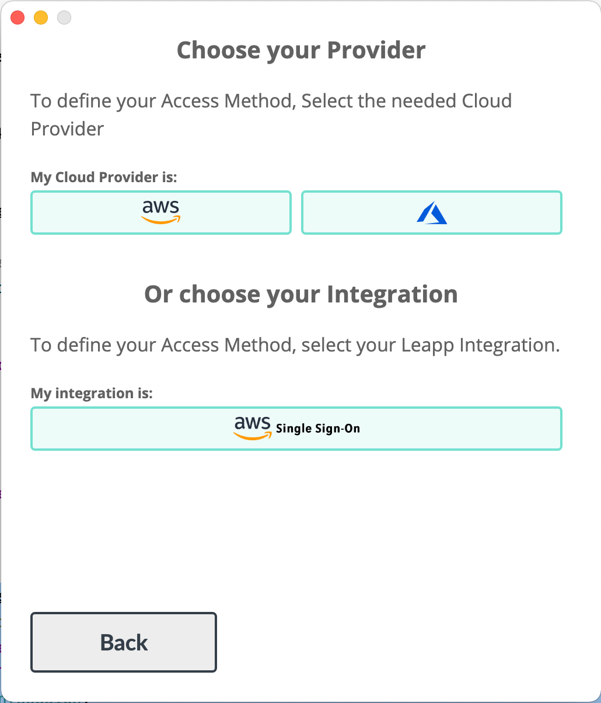
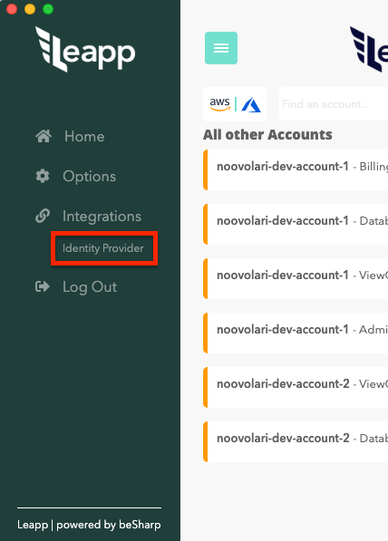

# Setup AWS SSO Access Method in Leapp

To start using AWS SSO in Leapp you first need to retrieve two information from your AWS account:
the **Portal URL** and the **AWS SSO region**.

- **Portal URL**: the AWS SSO user portal is a central place where users can see and access their
  assigned AWS accounts, roles, and applications. Providing an AWS SSO user portal URL allows to
  integrate AWS and third-party applications like Leapp.
  To retrieve it check the email your administrator has send you containing the portal URL.

- **AWS SSO region**: this is the region where you have configured your AWS SSO.
  You can retrieve the region easily from AWS console or by contacting your administrator.

Now you can go to your Leapp Application and add your AWS SSO configuration in two scenarios:

1) **First time access**: as you're accessing Leapp for the first time you can choose to
   configure all of your session directly from AWS SSO. To do so press **Start** and go to the next screen.
   In the next screen select **AWS SSO** like in the picture below:

In the following screen insert the **portal url** and the **region**. then press the **AWS SSO** button.

if everything is correct you'll be prompted with the following screen:

Click on the orange button, and Leapp will connect to your AWS SSO portal retrieving all the sessions for you.

2) **You already have some sessions**: to add sessions from your AWS SSO portal, go to the **option menu** clicking on the **azure hamburger button** on the **top-left of Leapp header**.
   From the sidebar menù choose **integration - Identity Provider** like in the screenshot below:

In the following screen insert the **portal url** and the **region**. then press the **AWS SSO** button.

if everything is correct you'll be prompted with the following screen:

Click on the orange button and Leapp will connect to your AWS SSO portal retrieving all the sessions for you.

