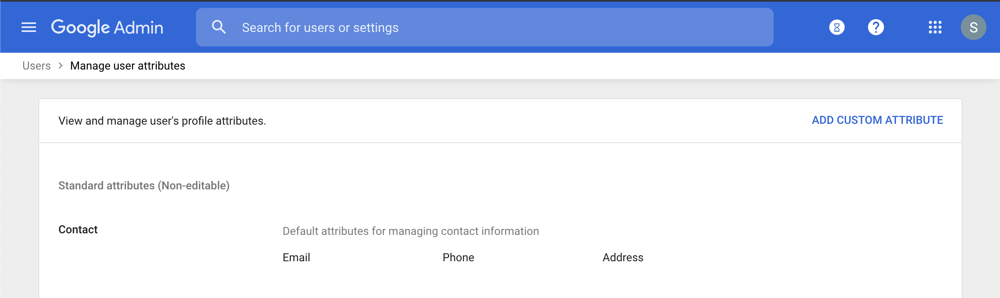
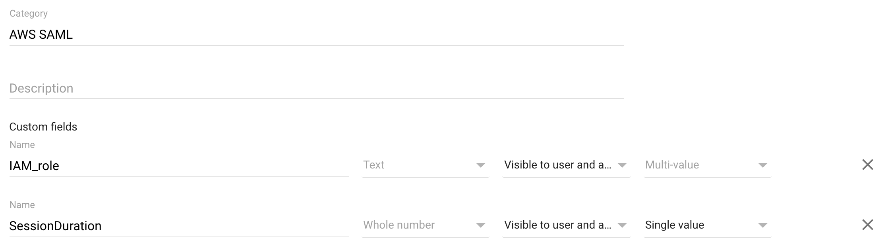
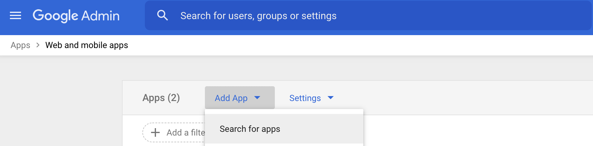
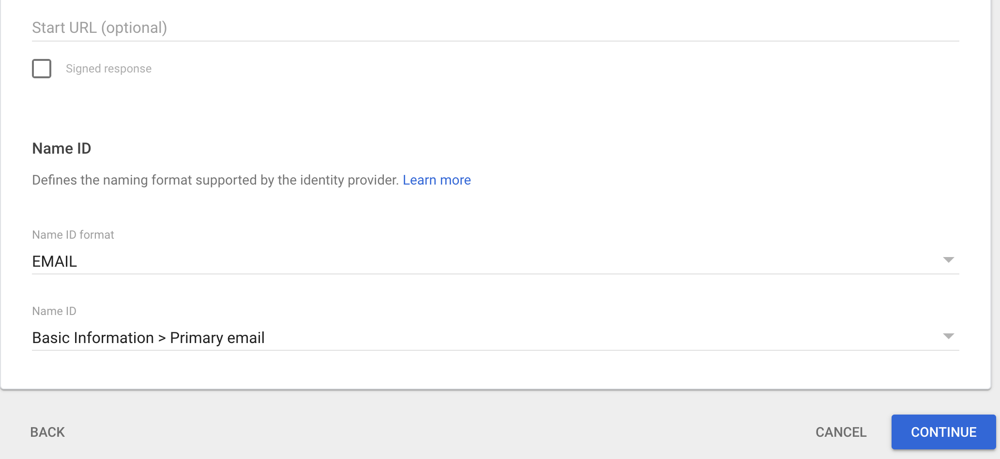
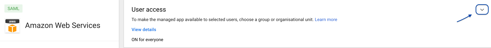
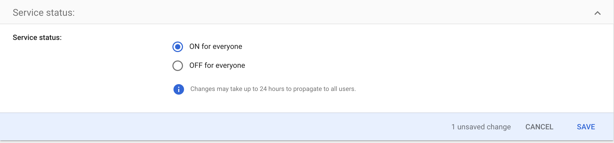

# How to set up G Suite federation

Let’s start with G Suite & AWS federation:

## 1. Log in to your Google Admin Console and click on the user button as shown in figure:

## 2. Create a new category of custom attributes

### a. Click *Manage Custom Attributes*

In the G Suite directory, once in *Users* screen, select *More* from the top menu. Then select “**Manage Custom Attributes”.**

### b. Choose “Add Custom Attribute”

In the top-right corner of the page click on “Add Custom Attribute”.

### c. Fill the Form

Fill the form like in the figure below:

## 3. Create a SAML-Based application

In order to set up a SAML-Based Single Sign-On, we first need to create a custom application representing AWS.

### a. Return to main page and browse to the "Apps" section

### b. Add a new SAML application

### Select Amazon Web Services template

Click on the “Add apps” selector in the menu bar, then "Search app" like in figure:

Then Search for "Amazon Web Services", wait for search to complete then select the one in figure, being careful to check that is a "Web SAML":

### Save the IDP Metadata file
The IDP Metadata is a .xml file containing configuration parameters and the X509 certificate. It enables the trust relationship between Identity and Service Provider. Save it; we will use it in a later step.

> :warning: **The metadata file must be kept secret and securely stored **: the security of the solution relies on its secrecy.

### Choose the Service Provider’s details id
Under **Service Provider Details**, select **EMAIL** choosing from the **Name ID Format** drop-down like in figure, leave the rest as it is.

### Add the attribute Mapping
The attributes previously created are associated and mapped to the **SAML assertion**. The first 2 are predefined by Google, set the following mapping with the help of the figure:

- [https://aws.amazon.com/SAML/Attributes/RoleSessionName](https://aws.amazon.com/SAML/Attributes/RoleSessionName) -> Basic Information -> Primary Email
- [https://aws.amazon.com/SAML/Attributes/Role](https://aws.amazon.com/SAML/Attributes/Role) -> AWS_SAML -> IAM_Role

Add another mapping and set it like this:

- [https://aws.amazon.com/SAML/Attributes/SessionDuration](https://aws.amazon.com/SAML/Attributes/SessionDuration) -> AWS_SAML -> SessionDuration

This is the final setup:

## 4. Enable the SAML App

### a. Turn ON the App

Go back to the **SAML app menu list (from the Admin Panel, select “Apps”) and select the Amazon Web Services line:

Go to the user panel like in the figure and click on the down chevron icon:

Once in the panel click on **"ON for everyone"** and press save.

Now you’ve added the Amazon Web Service application to your App Google menu.

### b. Get the SAML App link
Click on your App Google menu, locate the new entry, and right-click on it to copy its value. We will need this in the next tutorial.

Congratulations, the first phase of the federation is complete, follow up with the next tutorial to set up the federation on AWS side.
