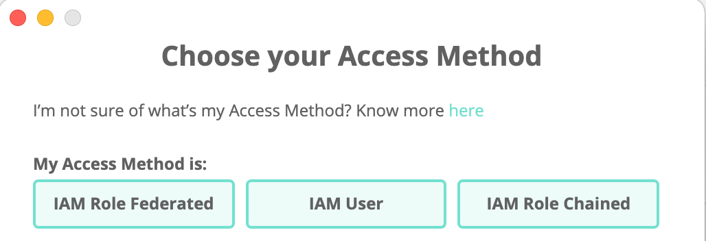

# How to create a IAM User Access Method for AWS

If this is your first time accessing Leapp please follow this [guide](../../../tutorials/first_access.md).

1) From your quick list click on the "+" button located on the top-right corner of the app

You'll be presented with the **Provider Selection** screen:

2) Choose "**AWS**" as a Cloud Provider, than you'll be presented with the **Access Strategy** selection screen:

Select "**IAM User**" as the Access Strategy.

3) As the last screen you'll be presented with the actual account creation screen:

- **Session Alias:** choose a unique name suitable to recognize the Access Method.
- **MFA Device**: Get it from your IAM User if any: check for its **role ARN** or if from a physical device its **serial number**.

- **Region**: The AWS Region you want your credentials to work on.
- **Access Key / Secret Key:** get the credentials from your IAM User.

Here you can also set a new MFA device by clicking on "Manage" in the AWS console at the voice *Assigned MFA device*. **IF** an MFA **arn** is inserted in the form field, then Leapp will ask for MFA token before trying to generate temporary credentials.

Finally press **Save**.
