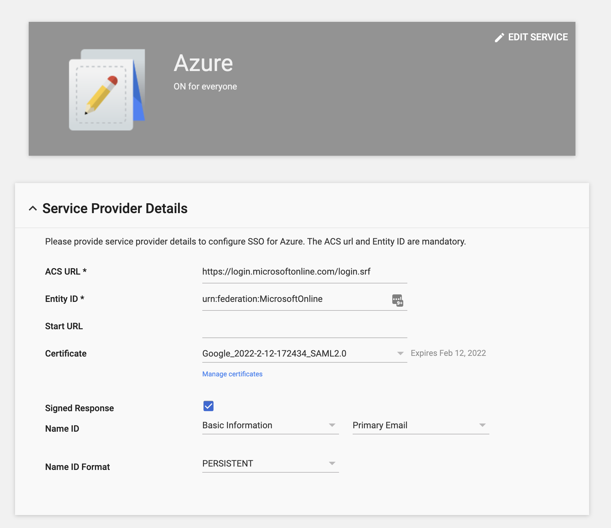
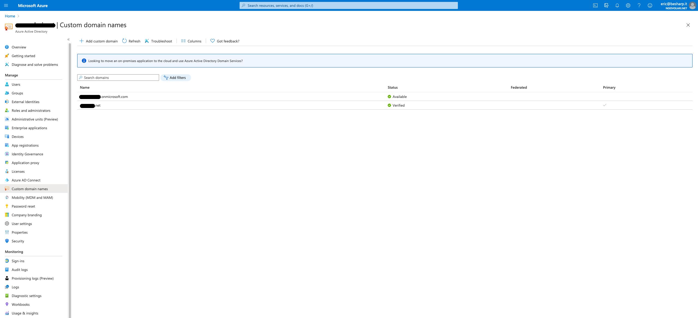

# Federation between G Suite and Azure AD

### G Suite side



*G Suite SAML Application setup.*


*Modal from which you can download the metadata XML file.*

### Azure side

#### Custom domain name

- Create a custom domain name.
- Verify through DNS TXT record.
- **Leave .onmicrosoft.com as the primary domain**

Inside the Azure Active Directory Service, go to Custom domain names. Here you can find default and custom domain names associated to the root account.



A custom domain name could be federated to G Suite only if it is not the primary account.

### Create <YOUR DOMAIN> Users

You need to create a User in Azure Active Directory for each G Suite User to whom you want to allow
access to your Tenant's resources. Users' permissions should be set inside the Subscription's "Access control (IAM)" section.

For example, create jon@your_domain.net and doe@your_domain.net.
We specified **your_domain.net** for the sake of this tutorial.

### Set Users' ImmutableId

ImmutableId must be set before federating G Suite with Azure Active Directory.

```jsx
Set-MsolUser -UserPrincipalName jon@your_domain.net -ImmutableId jon@your_domain.net
Set-MsolUser -UserPrincipalName doe@your_domain.net -ImmutableId doe@your_domain.net
```

Remove users from recycle bin to avoid conflicts when setting new users' ImmutableId.

### Federation between G Suite and Azure AD through PowerShell script

---

**Prerequisites**

- Create new custom domain; it should NOT be the primary one
- Set users' ImmutableId
- Run MSOnline module's `Set-MsolDomainAuthentication` as a Member and not as a Guest user
- Member user should have sufficient privileges to run MSOnline module's `Connect-MsolService`

You can find the MSOnline module's documentation [here](https://docs.microsoft.com/en-us/powershell/module/msonline/?view=azureadps-1.0#msonline).

---

**USE POWERSHELL AT ALL COSTS!!!
Federation could not be done via Azure Portal. Therefore we rely on PowerShell run with Administrator privileges.**

```powershell
Install-Module MSOnline

Connect-MsolService

$domainName = "your_domain.net"
[xml]$idp = Get-Content <metadata-xml-file-path>
$activeLogonUri = "https://login.microsoftonline.com/login.srf"
$signingCertificate = ($idp.EntityDescriptor.IDPSSODescriptor.KeyDescriptor.KeyInfo.X509Data.X509Certificate | Out-String).Trim()
$issuerUri = $idp.EntityDescriptor.entityID
$logOffUri = $idp.EntityDescriptor.IDPSSODescriptor.SingleSignOnService.Location[0]
$passiveLogOnUri = $idp.EntityDescriptor.IDPSSODescriptor.SingleSignOnService.Location[0]

Set-MsolDomainAuthentication `
  -DomainName $domainName `
  -FederationBrandName $domainName `
  -Authentication Federated `
  -PassiveLogOnUri $passiveLogOnUri `
  -ActiveLogOnUri $activeLogonUri `
  -SigningCertificate $signingCertificate `
  -IssuerUri $issuerUri `
  -LogOffUri $logOffUri `
  -PreferredAuthenticationProtocol "SAMLP"
```

`<metadata-xml-file-path>`: path to the XML file downloaded from the G Suite SAML App.
