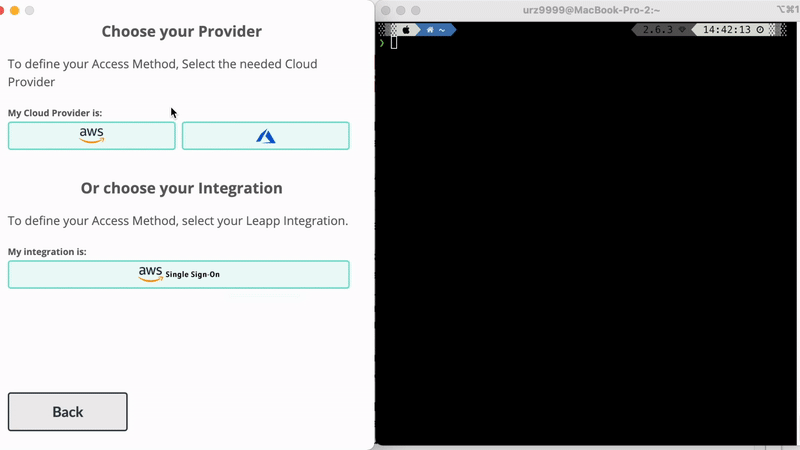
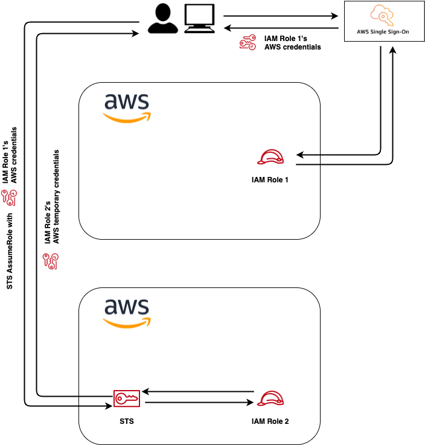

# AWS IAM Roles

## AWS IAM Federated Role
Federation is established between **G Suite**, **Okta**, **OneLogin** and **AWS**. No more AWS credentials
management is needed.

Leapp allows you to get to cloud resources with company email and password.

See setup [tutorial](../tutorials/aws/iam_federated_role/intro.md)

## AWS IAM Chained Role
Access to an Aws Account Role via another AWS Account role or an IAM user, thanks to a cross-account role available via [STS](https://docs.aws.amazon.com/STS/latest/APIReference/welcome.html).

In this access strategy a **IAM Chained Role** is assumed by a **IAM User**, a **IAM Federated Role**, or an **AWS SSO Role**.

See setup [tutorial](../tutorials/aws/iam_chained_role/intro.md)

> *Note: it's possible to apply MFA to a truster session by setting it on the plain account it relies on.*
